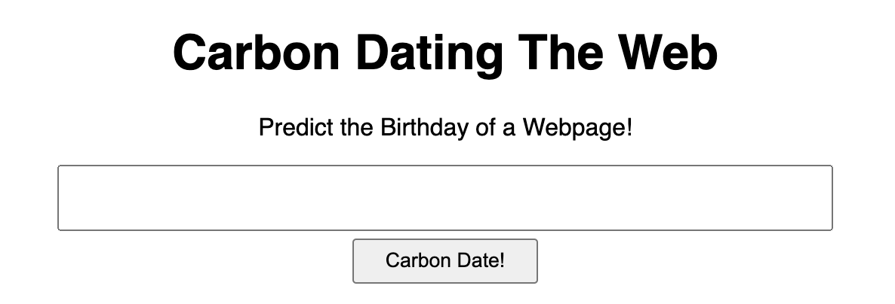
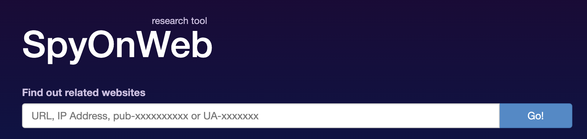
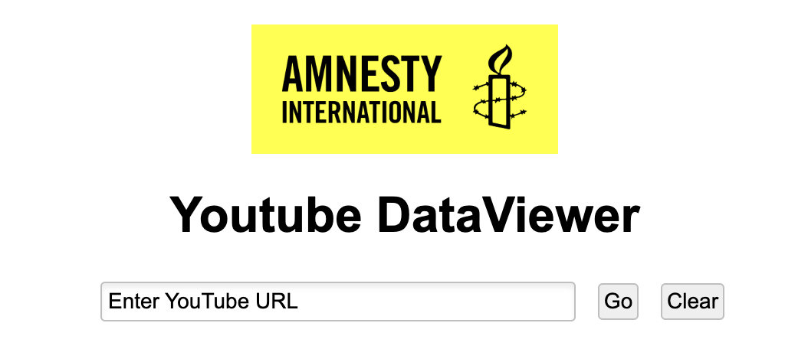
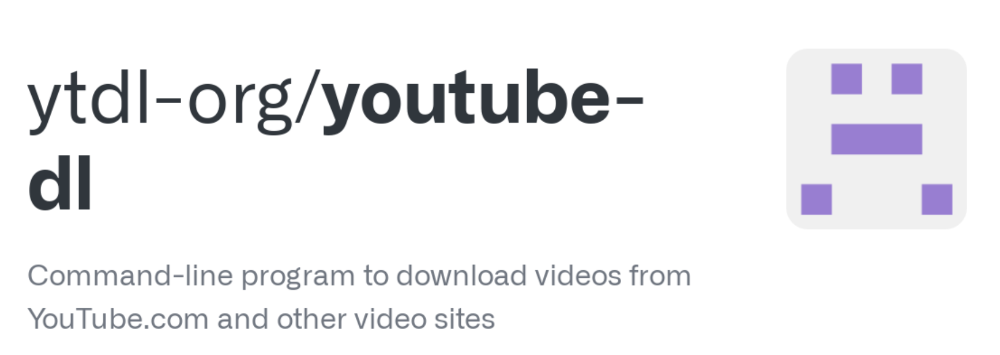

## Met deze **89** tools kun jij een luie (lees: <mark>efficiënte</mark>, <mark>doelgerichte</mark> en <mark>innovatieve</mark>) journalist worden

**tools**: **[Zoekmachines](#zoekmachines)** • **[Email & Telefoon](#emailphone)** • **[Usernames](#usernames)** • **[Websites & Domeinen](#websites)** • **[Sociale Media](#social)**: *[Facebook](#fb)* • *[Instagram](#insta)* • *[Telegram](#telegram)* • *[YouTube](#youtube)* • *[TikTok](#tiktok)* • *[Reddit](#reddit)* • *[Discord](#discord)* • *[X (voorheen Twitter)](#twitter)* • *[LinkedIn](#linkedin)* • *[Mastodon](#mastodon)* • *[Bluesky](#bluesky)* • **[Verificatie](#verificatie)** • **[Data](#data)**: *[Verzamelen](#verzamelen)* • *[Bewerken](#bewerken)* • *[Visualiseren](#visualiseren)* • **[AI](#ai)** • **[Crypto](#crypto)** • **[Overig](#overig)**

*"Ken je nog een tooltje voor...", is een van de meest gestelde vragen onder journalisten, onderzoekers en iedereen die nieuwsgierig is. Iedereen wil <mark>meer, beter en efficiënter</mark> onderzoek doen. Eigenlijk moet je jezelf de vraag stellen: "Hoe kan ik een luie journalist worden?"*

*En nee, natuurlijk zijn journalisten niet lui. Maar we kunnen wel leren van luie mensen. Hoe kun je iemand – of in dit geval, iets – anders <mark>het zware werk laten doen</mark>? Deze site helpt je daarbij. Hieronder vind je websites, scripts en apps die technisch ingewikkeld en tijdrovend werk voor je kunnen opknappen.*

*Reminder: tools zijn niets waard zonder te begrijpen hoe ze werken. Het is enkel een <mark>shortcut voor handmatig werk</mark>. Dus vertrouw de resultaten uit zo'n tool niet zonder te snappen wat er onder de motorkap plaatsvindt. En onthoud: <mark>don't be evil</mark>. Je kunt alle tools inzetten voor goede, maar ook voor kwade bedoelingen.*

*Heb je een goede toevoeging aan deze site? Of wil je een bedankje sturen? [Check onderaan deze pagina hoe je met mij in contact kunt komen ⬇](#einde)*

### <i class="fa fa-search" aria-hidden="true"></i> Zoekmachines
Je bent natuurlijk allang bekend met alle grote zoekmachines, zoals Google, Bing en Yandex. Met onderstaande gespecialiseerde zoekmachines kun je nog dieper in het web duiken.

##### <a href="https://e-justice.europa.eu/content_find_a_company-489-en.do" target="_blank">E-justice Business Register</a> | <mark>Website</mark>

In dit register kun je internationaal zoeken in alle Kamers van Koophandel van EU-landen. Erg handig als je niet exact weet op welke site je in het buitenland moet zoeken.

##### <a href="https://haveibeenpwned.com/" target="_blank">HaveIBeenPownd</a> | <mark>Website</mark>

Op deze site kun je checken of een emailadres in een datalek voorkomt. Handig om je eigen digitale veiligheid te checken, maar ook om te controleren of een mailadres daadwerkelijk gebruikt wordt. Voor telefoonnummers kun je checken of ze in de <a href="https://nos.nl/artikel/2375266-gegevens-van-honderden-miljoenen-facebookgebruikers-op-hackersforum-gedeeld" target="_blank">Facebook Data Breach</a> hebben gestaan.

##### <a href="https://www.shodan.io/" target="_blank">Shodan</a> | <mark>Website</mark>

Shodan is de zoekmachine voor apparaten die aan het internet zijn verbonden. <a href="https://github.com/lothos612/shodan" target="_blank">Check ook deze pagina</a> om slimme zoekopdrachten (dorks) te formuleren.

##### <a href="https://www.social-searcher.com/" target="_blank">SocialSearcher</a> | <mark>Website</mark>

SocialSearcher is een zoekmachine waarmee je o.a. in de openbare comments van Reddit, YouTube, Facebook en VKontakte kunt zoeken.

##### <a href="https://search.0t.rocks/" target="_blank">ZeroTrust</a> | <mark>Website</mark>

Op Search.0t.rocks (spreek uit als ZeroTrust) kun je door meerdere datalekken zoeken en worden de zoekresultaten aan elkaar gekoppeld. Wachtwoorden zijn niet zichtbaar. De site is meerdere keren offline gehaald, maar <a href="https://github.com/MiyakoYakota/search.0t.rocks" target="_blank">hier staat de code</a> om je eigen versie te hosten.

**[terug naar overzicht ⬆](#)**

### <i class="fa fa-envelope" aria-hidden="true"></i> Email & Telefoon
Het startpunt van veel online onderzoeken: een anoniem mailadres of telefoonnummer. Meestal wil je weten wie zich daarachter verschuilt. Deze tools kunnen je daarbij helpen.

##### <a href="https://epieos.com/" target="_blank">Epieos</a> | <mark>Website</mark>

Op Epieos kun je checken waar specifieke telefoonnummers en mailadressen worden gebruikt. Vooral handig voor Google-accounts en Skype.

##### <a href="https://github.com/megadose/holehe" target="_blank">Holehe</a> | <mark>Script</mark>

Met Holehe kun je checken of een emailadres is geregistreerd op >50 websites. Bij sommige sites krijg je ook info over het account zelf.

##### <a href="https://github.com/AzizKpln/Moriarty-Project" target="_blank">Moriarty</a> | <mark>Script</mark>

Met Moriarty kun je checken of een telefoonnummer bekend staat als dubieus. Ook wordt gezocht of er socialmedia-accounts aan dit nummer zijn gekoppeld.

##### <a href="https://osint.industries/" target="_blank">OSINT.industries</a> | <mark>Website</mark>

Op OSINT.Industries kun je (grotendeels betaald) rondzoeken op welke websites specifieke mailadressen en telefoonnummers staan geregistreerd. Onderzoeksjournalisten kunnen <a href="https://osint.industries/journalist" target="_blank">een gratis account aanvragen</a>.

##### <a href="https://github.com/sundowndev/phoneinfoga" target="_blank">PhoneInfoga</a> | <mark>Script</mark>

Met PhoneInfoga kun je opzoeken of een telefoonnummer bestaat en welke basisgegevens daarover te vinden zijn. Ook kun je checken aan welke accounts dat nummer is gekoppeld.

##### <a href="https://github.com/jakecreps/poastal" target="_blank">Poastal</a> | <mark>Script</mark>

Met Poastal lanceer je een zoekmachine in je browser waarmee je kunt uitzoeken of een mailadres geregistreerd staat bij specifieke sociale media. Daarnaast kun je uitzoeken of een mailadres überhaupt bestaat, mail kan ontvangen en bekendstaat als spam.

**[terug naar overzicht ⬆](#)**

### <i class="fa fa-user" aria-hidden="true"></i> Usernames
Stel, je komt tijdens je onderzoek het anonieme account <code>droge_poepsteek</code> tegen. Loopt het spoor dan dood? Met deze tools kun je alsnog aanknopingspunten vinden.

##### <a href="https://github.com/soxoj/maigret" target="_blank">Maigret</a> | <mark>Script</mark>

Met Maigret kun je opzoeken welke username aan welke websites is gekoppeld. Het is een zeer uitgebreide versie van Sherlock (ook hieronder te vinden), maar daardoor ook een stuk trager. Je kunt Maigret ook gebruiken in Telegram via het account <a href="https://t.me/osint_maigret_bot" target="_blank">@osint_maigret_bot</a>.

##### <a href="https://github.com/sherlock-project/sherlock" target="_blank">Sherlock</a> | <mark>Script</mark>

Met Sherlock kun je checken of een username op bepaalde sites is geregistreerd. Een snellere, maar ook iets minder uitgebreide versie van Maigret.

##### <a href="https://whatsmyname.app/" target="_blank">WhatsMyName</a> | <mark>Website</mark>

Op WhatsMyName.app kun je snel op bijna 600 websites zoeken of die username staat geregistreerd. Je kunt het resultaat direct exporteren als csv-bestand.

**[terug naar overzicht ⬆](#)**

### <i class="fa fa-globe" aria-hidden="true"></i> Websites & Domeinen
Online websites, de digitale snelweg, het wereldwijde web: je komt er nog eens wat tegen. Zodra je onderzoek moet doen naar een website of domeinnaam, dan kun je onderstaande tools goed gebruiken.

##### <a href="https://adbeat.com/" target="_blank">Adbeat</a> | <mark>Website</mark>

Met Adbeat kun je de affiliate links van websites analyseren. Waar leiden ze naartoe? Handig als je online advertenties gaat onderzoeken.

##### <a href="https://analyzeid.com/" target="_blank">Analyze ID</a> | <mark>Website</mark>

Met Analyze ID kun je onderzoeken welke websites van dezelfde eigenaar zijn op basis van email, Facebook ID’s, Adsense, Google Analytics en IP-adres.

##### <a href="https://themarkup.org/blacklight" target="_blank">Blacklight</a> | <mark>Website</mark>

Met Blacklight van <a href="https://themarkup.org/" target="_blank">The Markup</a> kun je analyseren hoe je op diverse websites wordt gevolgd door cookies, ad trackers, Google Ads, etc.

##### <a href="https://builtwith.com/" target="_blank">BuildWith</a> | <mark>Website</mark>

Met BuildWith kun je snel checken wat de onderliggende techniek van een website is.

##### <a href="https://carbondate.cs.odu.edu/" target="_blank">Carbon Dating The Web</a> | <mark>Website</mark>

Carbon Dating The Web is een website waarmee je een redelijke schatting kunt maken wanneer een website is gemaakt.

##### <a href="https://dnslytics.com/" target="_blank">DNSlytics</a> | <mark>Website</mark>

Met DNSlytics kun je snel een overzicht krijgen van alle kenmerken van een website: IP, servers, mailservers, redirects, etc.

##### <a href="http://spyonweb.com/" target="_blank">SpyOnWeb</a> | <mark>Website</mark>

Met SpyOnWeb kun je zien welke tracking codes (advertenties bijvoorbeeld) een website gebruikt, en welke sites je daarmee aan elkaar kunt linken.

##### <a href="https://viewdns.info/" target="_blank">ViewDNS</a> | <mark>Website</mark>

Op ViewDNS staan verschillende modules waarmee je websites kunt analyseren. Het meest nuttig zijn:
* Reverse IP Lookup → Staan op dit domein / IP meerdere websites gehost?
* Reverse WHOIS Lookup → Staan op dit mailadres nog meer websites geregistreerd?

##### <a href="https://visualping.io/" target="_blank">Visualping</a> | <mark>Website</mark>

Als je wil weten wanneer een website verandert, dan kun je dat op Visualping in de gaten houden. Je krijgt een alert via de mail wanneer de website is gewijzigd.

##### <a href="https://website.informer.com/" target="_blank">WebsiteInformer</a> | <mark>Website</mark>

Op Website Informer kun je snel zien wie de eigenaar van een website is. Lijkt ook veel resultaten uit het verleden en veel verschillende domeinnamen te geven.

##### <a href="https://well-known.dev/" target="_blank">Well-Known</a> | <mark>Website</mark>

Op Well-Known kun je zoeken naar de ads.txt op een website: het overzicht van advertenties dat op die site wordt vertoond. Zodra je inlogt, kun je verder zoeken op de directe adverteerders en websites die dezelfde Google Ads-codes gebruiken.

##### <a href="https://whois-history.whoisxmlapi.com/" target="_blank">WHOIS History</a> | <mark>Website</mark>

Via deze site kun je in historische WHOIS-registraties zoeken naar de eigenaar van een domeinnaam. Heeft wel een limiet, dus spaarzaam gebruiken.

##### <a href="https://www.whoxy.com/" target="_blank">Whoxy</a> | <mark>Website</mark>

Op Whoxy kun je zoeken op welke naam een website staat geregistreerd. Ook kun je zoeken of op een mailadres een website staat geregistreerd.

**[terug naar overzicht ⬆](#)**

### <i class="fa fa-share" aria-hidden="true"></i> Sociale Media
Grote kans dat elk online onderzoek op een gegeven moment uitkomt bij een sociaal medium. Hieronder vind je de grootste, meest bekende of opkomende platforms.

#### Facebook
Facebook doet al jarenlang zijn best om allerlei ontwikkelde tools voor onderzoekers en journalisten onbruikbaar te maken. Ondanks dat zijn er genoeg mogelijkheden om de stroom aan mis- en desinformatie op deze site te onderzoeken.

##### <a href="" target="_blank">CrowdTangle</a> | <mark>Website</mark>

Met CrowdTangle (een dienst die door Facebook zelf wordt beheerd) kun je meerdere openbare Facebook-berichten analyseren. Wat is trending? En zit daar mogelijk misinformatie tussen?

##### <a href="" target="_blank">Facebook Friend List Scraper</a> | <mark>Scraper</mark>

Met de FB Friend List Scraper kun je de vrienden van openbare Facebookprofielen scrapen.

##### <a href="" target="_blank">FDown</a> | <mark>Website</mark>

Met FDown kun je snel openbare Facebook-video’s downloaden.

##### <a href="" target="_blank">Lookup ID</a> | <mark>Website</mark>

Met Lookup.id kun je de ID-code van een Facebook-profiel vinden. Voor sommige andere zoekdiensten kan die ID-code handig zijn.

##### <a href="" target="_blank">SowSearch</a> | <mark>Website</mark>

Met SowSearch kun je grotendeels zoeken zoals je dat eerder kon met Graph Search. Vooral handig als je complexe zoekopdrachten wil formuleren.

##### <a href="" target="_blank">Who Posted What</a> | <mark>Website</mark>

Met WhoPostedWhat kun je uitgebreid zoeken in openbare posts op Facebook. Hiervoor heb je vaak een ID-code nodig (zie hierboven bij Lookup ID).

**[terug naar overzicht ⬆](#)**

#### Instagram
Zelfs mensen met een bloedhekel aan Facebook zitten vaak met veel plezier op Instagram. Alles is hier leuk, gezellig en vriendelijk. Zelfs met alle spambots, scammers en dubieuze reclamecampagnes die je hier kunt aantreffen.

##### <a href="https://imginn.io/" target="_blank">IMGinn</a> | <mark>Website</mark>

Op IMGinn kun je de profielnaam van een openbaar profiel opgeven, en direct de afbeeldingen en video’s downloaden.

##### <a href="https://github.com/sc1341/InstagramOSINT" target="_blank">InstagramOSINT</a> | <mark>Scraper</mark>

Met deze tool kun je een specifiek Instagram-account volledig analyseren en scrapen.

##### <a href="https://github.com/instaloader/instaloader" target="_blank">Instaloader</a> | <mark>Scraper</mark>

Met dit script kun je een volledig Instagram-profiel (inclusief comments, hashtags, captions, etc.) downloaden.

##### <a href="https://snapinsta.app/" target="_blank">SnapInsta</a> | <mark>Website</mark>

Met SnapInsta kun je vrij eenvoudig video’s, reels, foto’s, stories en IGTV downloaden.

##### <a href="https://github.com/megadose/toutatis" target="_blank">Toutatis</a> | <mark>Script</mark>

Met Toutatis kun je meer informatie vinden over het (gedeeltelijke) telefoonnummer en emailadres dat is gebruikt om een Instagram-account aan te maken.

**[terug naar overzicht ⬆](#)**

#### Telegram
Ook wel het 'Whatsapp van Oost-Europa' genoemd. De afgelopen jaren duiken steeds meer dubieuze groepen op in Telegram. Dat maakt het voor journalisten en onderzoekers een perfecte grabbelton voor nieuwe onderwerpen.

##### <a href="https://github.com/bellingcat/telegram-phone-number-checker" target="_blank">Bellingcat Phonenumber Check</a> | <mark>Script</mark>

Met dit script (geschreven door Bellingcat) kun je checken of een telefoonnummer is gekoppeld aan een Telegram-account.

##### <a href="https://github.com/danog/MadelineProto/" target="_blank">MadelineProto</a> | <mark>Scraper</mark>

Script om de Telegram-API mee aan te spreken. Handig om scrapers mee te maken, maar je moet dus nog wel zelf flink wat programmeren.

##### <a href="https://github.com/pigpagnet/save-telegram-chat-history" target="_blank">Save Telegram Chat History</a> | <mark>Plugin</mark>

Met deze Chrome-plugin kun je de volledige geschiedenis van een kanaal of groep downloaden. Je moet echter wel de oude interface van Telegram gebruiken. Om dat te doen, voeg je <code>?legacy=1</code> achter de url web.telegram.org.

##### <a href="https://gist.github.com/fabledowl/8c8db5858e096866c42dfa114034f0f2/raw/getUsers.user.js" target="_blank">Tampermonkey + Download Users</a> | <mark>Plugin</mark>

Met dit <a href="https://www.tampermonkey.net/" target="_blank">Tampermonkey-script</a> kun je de leden van de meeste Telegram-groepen en -kanalen downloaden. Ook zie je wie de oprichter van een groep is. Hiervoor moet je wel in de oude versie van Telegram werken. Om dat te doen, voeg je <code>?legacy=1</code> achter de url web.telegram.org.

##### Telegram zoekmachines | <mark>Website</mark>

Op deze sites kun je door gearchiveerde Telegram-groepen en -kanalen zoeken. Handig om onderwerpen in te vinden. Je kunt door de volgende sites struinen:
* <a href="https://tgstat.com/" target="_blank">Tgstat</a>
* <a href="https://telemetr.me/" target="_blank">Telemetr.me</a>
* <a href="https://telemetr.io/" target="_blank">Telemetr.io</a>
* <a href="https://lyzem.com/" target="_blank">Lyzem</a>
* <a href="https://tgramsearch.com/" target="_blank">Tgramsearch</a>
* <a href="https://cse.google.com/cse?cx=6c3e0c0d3da8e3b4a" target="_blank">Telegago</a>

**[terug naar overzicht ⬆](#)**

#### YouTube
Ooit, lang geleden, was YouTube nog een site waar korte vlogs en kattenfilmpjes werden gepost. Nu kun je er urenlange podcasts, uitgebreide documentaires en de brainfarts van je geradicaliseerde buurjongen vinden.

##### <a href="http://amnestyusa.org/sites/default/custom-scripts/citizenevidence" target="_blank">Amnesty YouTube Dataviewer</a> | <mark>Website</mark>

Met de Amnesty YouTube Dataviewer kun je reversed Image Search uitvoeren op YouTube-video's om foto's, video's en audio te vinden. Het is niet 100% accuraat, maar kan verrassend veel resultaten opleveren.

##### <a href="http://www.watchframebyframe.com/" target="_blank">Watch Frame By Frame</a> | <mark>Website</mark>

Met Watch Frame By Frame kun je YouTube-video’s per frame bekijken. Erg handig als je een specifiek frame nodig hebt voor je onderzoek.

##### <a href="https://github.com/jdepoix/youtube-transcript-api" target="_blank">YouTube Transcript / Subtitle API</a> | <mark>Scraper</mark>

Met dit script kun je de transcripten (inclusief vertalingen) van YouTube-video’s scrapen.

##### <a href="https://chrome.google.com/webstore/detail/youtube-word-searcher/jichoejagacnbcinlgncghhdegdlhbcj/related" target="_blank">YouTube Word Searcher</a> | <mark>Plugin</mark>

Met deze Chrome plugin kun je zoeken naar specifieke woorden in een YouTube-video. Je kunt gelijk naar de tijdcode scrollen waarop dat woord wordt gezegd.

##### <a href="https://github.com/ytdl-org/youtube-dl" target="_blank"><YouTube-dl/a> | <mark>Scraper</mark>

Met YouTube-dl kun je binnen no-time via de terminal YouTube-video’s downloaden.

**[terug naar overzicht ⬆](#)**

#### TikTok
Een oneindige feed vol korte video’s: TikTok is extreem verslavend en enorm interessant om te onderzoeken. Er zijn helaas nog niet veel tools die (blijven) werken voor dit platform.

##### 

**[terug naar overzicht ⬆](#)**

#### Reddit
Een van de weinige online forums waar je intelligente en doordachte gesprekken kunt aantreffen. En natuurlijk veel kattenmemes.

##### <a href="https://f5bot.com/" target="_blank">F5Bot</a> | <mark>Website</mark>

Met F5Bot kun je custom alerts opzetten voor Reddit. Laat jezelf mailen zodra een specifiek steekwoord wordt gezegd.

##### <a href="http://karmadecay.com/" target="_blank">Karma Decay</a> | <mark>Website</mark>

Reversed Image Search om gelijksoortige of identieke afbeeldingen op Reddit te vinden.

##### <a href="https://kerrick.github.io/Mostly-Harmless" target="_blank">Mostly Harmless</a> | <mark>Plugin</mark>

Mostly Harmless is een browser plugin waarmee je kunt zien of een url al op Reddit is gedeeld. Zo ja, dan kun je direct het gesprek rondom dat artikel bekijken.

##### <a href="https://reddit-user-analyser.netlify.app/" target="_blank">Reddit User Analyser</a> | <mark>Website</mark>

Met Reddit User Analyser kun je alle statistieken van een Reddit-account bekijken.

##### <a href="https://www.resavr.com/" target="_blank">Resavr</a> | <mark>Website</mark>

Op Resavr kun je veel verwijderde comments op Reddit weer terugvinden.

##### <a href="https://github.com/JosephLai241/URS" target="_blank">Universal Reddit Scraper</a> | <mark>Scraper</mark>

Universal Reddit Scraper (URS) heeft een uitgebreide interface waarin je kunt aangeven wat je precies van Reddit wil binnenhalen. Je kunt subreddits, accounts en comments scrapen.

**[terug naar overzicht ⬆](#)**

#### Discord
Discord begon als exclusief platform voor jongeren om te voicechatten tijdens games. Maar je kunt nu talloze communities vinden op dit platform. De voiceberichten maken het misschien wat lastig om te onderzoeken, maar op Discord kun je ook veel geschreven berichten vinden.

##### <a href="https://disboard.org/servers" target="_blank">Disboard</a> | <mark>Website</mark>

Via deze site kun je zoeken naar openbare Discord-servers.

##### <a href="https://dht.chylex.com/" target="_blank">Discord History Checker</a> | <mark>Software</mark>

Met deze software kun je de volledige gespreksgeschiedenis van servers, groepen en DM’s downloaden.

##### <a href="https://hugo.moe/discord/discord-id-creation-date.html" target="_blank">Discord ID Creation Date Checker</a> | <mark>Website</mark>

Met deze site kun je checken op welke datum een Discord-account is aangemaakt.

##### <a href="https://discordleaks.unicornriot.ninja/discord/server/" target="_blank">DiscordLeaks</a> | <mark>Website</mark>

Zoek in 100 duizenden gelekte extremistische Discord-gesprekken.

**[terug naar overzicht ⬆](#)**

#### X (voorheen Twitter)
Sinds  Elon Musk de baas werd, zijn bijna alle tools onbruikbaar geworden. Toch houd ik deze sectie op de site. Waarschijnlijk tegen beter weten in.

#### LinkedIn
Ooit begonnen als online CV-site, momenteel een slappe feed vol 'inspirerende' ervaringen van saaie mensen. Alsnog een goede bron van informatie, maar ik ken geen nuttige websites of tools voor LinkedIn.

#### Mastodon
Een Mastodon-account maken is een intens twijfelachtig proces: begrijp maar eens op welke server je je moet aanmelden. En vervolgens kom je op een platform waar - voor zover ik weet - nog geen nuttige tools voor zijn ontwikkeld.

#### Bluesky
Op Bluesky ervaar je het Twitter-gevoel voordat Twitter een platform voor misinformatie, extremisten en blaaskaken werd. Op dit moment zijn berichten op Bluesky alleen te zien zodra je bent ingelogd, en heb je een invite nodig om een account te maken. Voor zover ik weet, zijn er nog geen tools voor Bluesky ontwikkeld.

**[terug naar overzicht ⬆](#)**

### <i class="fa fa-check" aria-hidden="true"></i> Verificatie
Spoiler: niet alles wat je online vindt, is waar. Alle foto’s, video’s en andere informatie moet je dubbelchecken en verifiëren. Bestaat deze persoon wel echt? En is deze video wel op deze locatie gemaakt? Onderstaande tools kunnen je daarbij helpen.

##### <a href="https://seintpl.github.io/AmIReal/" target="_blank">Am I Real</a> | <mark>Website</mark>

Met dit script kun je foto’s analyseren of ze door ThisPersonDoesNotExist.com.zijn gegenereerd.

##### <a href="https://aws.amazon.com/getting-started/hands-on/detect-analyze-compare-faces-rekognition/" target="_blank">Amazon Rekognition</a> | <mark>Website</mark>

Hoeveel lijken twee gezichten op elkaar? Handig als je een persoon zoekt en twee foto’s met elkaar moet vergelijken.

##### <a href="https://facecheck.id/" target="_blank">Facecheck.id</a> | <mark>Website</mark>

Facecheck.id zoekt met gezichtherkenning waar een persoon nog meer voorkomt.

##### <a href="https://mever.iti.gr/forensics/" target="_blank">Image Verification Assistant</a> | <mark>Website</mark>

Met de Image Verification Assistant kun je analyseren of beeldmateriaal is gemanipuleerd. Ook zijn er talloze voorbeelden te vinden van gemanipuleerde afbeeldingen.

##### <a href="https://weverify.eu/verification-plugin/" target="_blank">InVID WeVerify</a> | <mark>Plugin</mark>

Enorm handige plugin waarmee je direct via Google, Yandex en Baidu Reversed Image Search kunt doen. Inclusief een aantal handige tools om fotomanipulatie mee te analyseren.

##### <a href="https://www.metadata2go.com/" target="_blank">Metadata2Go</a> | <mark>Website</mark>

Op Metadata2Go kun je snel de metadata van je afbeeldingen analyseren.

##### <a href="https://overpass-turbo.eu/" target="_blank">Overpass Turbo</a> | <mark>Website</mark>

Met Overpass Turbo kun je een zoekopdracht maken om specifieke landmarks op kaarten te ontdekken. Voorbeeld: vind alle onbewaakte spoorwegovergangen in een straal van 500 meter van een windmolen. Erg handig als je OSINT doet: zodra je specifieke aanwijzingen op een afbeelding ziet staan, dan kun je het aantal locaties snel beperken. Overpass Turbo vraagt wel om een zoekopdracht in een hele specifieke taal, maar ChatGPT kan je daar goed mee helpen. Je kunt al je gevonden landmarks exporteren om verder te analyseren in andere software.

Met Overpass Turbo kun je snel een query maken van specifieke landmarks op kaarten. Handig als je OSINT moet doen en specifieke dingen ziet waar je op kunt zoeken. Werkt erg handig als je je query in ChatGPT formuleert. Vervolgens kun je op de kaart zoeken of de locatie overeenkomt met wat je op de foto ziet. Een andere mogelijkheid is het exporteren van de objecten die je via de query hebt gevonden. Kan handig zijn als je in QGIS of R een analyse wil doen.

##### <a href="https://www.peakfinder.com/" target="_blank">Peakfinder</a> | <mark>Website</mark>

Met Peakfinder kun je foto’s geolocaten als daar een heuvel of berg in staat. Zodra je een vermoeden hebt waar het kan zijn, dan kun je die foto op die locatie uploaden en de omtrek van het landschap matchen met je afbeelding.

##### <a href="https://pimeyes.com/" target="_blank">PimEyes</a> | <mark>Website</mark>

Met PimEyes kun je zoeken op dezelfde persoon d.m.v. biometrische gelijkenissen. Let op, is een betaalde service.

**[terug naar overzicht ⬆](#)**

### <i class="fa fa-table" aria-hidden="true"></i> Data
Stukje introtekst

#### Verzamelen
Stukje introtekst

##### 

##### 

##### 

#### Bewerken
Stukje introtekst

##### 

##### 

##### 

#### Visualiseren
Stukje introtekst

##### 

##### 

##### 

**[terug naar overzicht ⬆](#)**

### <i class="fa fa-lightbulb-o" aria-hidden="true"></i> AI
Ik geef toe dat Terminator en The Matrix niet direct de meest positieve voorbeelden zijn van Kunstmatige Intelligentie. Deze films maken in ieder geval duidelijk dat zelfs kwaadaardige AI enorm slim, efficiënt en tijdbesparend kan zijn. Daarom kunnen onderstaande tools jouw werk eenvoudiger maken.

##### <a href="https://chat.openai.com/" target="_blank">ChatGPT</a> | <mark>Website</mark>

ChatGPT is eigenlijk een chatbot die antwoorden genereert op basis van externe informatie. Je kunt hier onwijs veel nuttige dingen mee doen. Voor mij zijn de volgende zaken het nuttigst:

* Queries maken voor <a href="https://overpass-turbo.eu/" target="_blank">Overpass Turbo</a>
* Suggesties voor nieuwskoppen maken
* Teksten voor socialmedia-berichten herschrijven
* Invalshoeken voor onderzoek genereren
* Delen Python-code schrijven voor scrapers

##### <a href="https://cleanup.pictures/" target="_blank">Cleanup Pictures</a> | <mark>Website</mark>

Met Cleanup Pictures kun je foto’s opschonen en objecten eenvoudig verwijderen. Kan handig zijn vlak voordat je een Reversed Image Search doet.

##### <a href="https://huggingface.co/" target="_blank">Hugging Face</a> | <mark>Website</mark>

Hugging Face is dé plek waar je AI-modellen kunt vinden. In sommige gevallen wordt de trainingsdata meegeleverd.

##### <a href="https://github.com/lobe" target="_blank">Lobe.ai</a> | <mark>Script</mark>

Met Lobe.ai kun je kunstmatige intelligentie trainen om beeldmateriaal te herkennen en te categoriseren. Had eerst een desktop-app, maar is nu alleen nog beschikbaar als script.

##### <a href="https://goodsnooze.gumroad.com/l/macwhisper" target="_blank">MacWhisper</a> | <mark>Software</mark>

Met MacWhisper (voor Macbooks) kun je hele goede transcripties maken van je audiobestanden, inclusief tijdcodes. Alle data blijft op je lokale machine staan. Helaas (nog) geen automatische sprekersherkenning.

##### <a href="https://www.midjourney.com" target="_blank">Midjourney</a> | <mark>Website</mark>

Simpelweg de beste methode om AI-gegenereerde afbeeldingen mee te maken. Via <a href="https://discord.com/invite/midjourney" target="_blank">de Discord-server van Midjourney</a> kun je (betaald en gratis) afbeeldingen maken via tekstprompts.

##### <a href="https://remini.ai/" target="_blank">Remini</a> | <mark>Website</mark>

Met Remini kun je foto’s van slechte kwaliteit met AI verbeteren. Let op: als je dit wil gebruiken om beeldmateriaal vervolgens te Reversed Image Searchen of verifiëren, dan is het resultaat dus iets onbetrouwbaarder.

##### <a href="https://www.remove.bg/" target="_blank">RemoveBG</a> | <mark>Website</mark>

Met RemoveBG (lees: Remove Background) kun je snel en eenvoudig de achtergrond van afbeeldingen verwijderen.

##### <a href="https://www.simonsaysai.com" target="_blank">Simon Says</a> | <mark>Website</mark>

Een van de beste manieren om beeldmateriaal mee te transcriberen. Je transcript wordt ook nog eens met het beeld gesynchroniseerd. Door het editten van tekst kun je ruwe montages maken. Je krijgt gratis credits om beeldmateriaal te transcriberen, maar die zijn snel op.

**[terug naar overzicht ⬆](#)**

### <i class="fa fa-btc" aria-hidden="true"></i> Crypto
Ah, de toekomst van ons betalingsverkeer: gedecentraliseerd, gepseudonimiseerd en encrypted. En vooral gebruikt door crypto-bro’s en georganiseerde misdaad. Dan is het handig om wat tools te hebben om zulke transacties inzichtelijk te maken.

##### <a href="https://live.blockcypher.com/" target="_blank">Blockcypher</a> | <mark>Website</mark>

Met Blockcypher kun je snel overzicht krijgen in allerlei crypto-transacties.

##### <a href="https://www.chainabuse.com/" target="_blank">ChainAbuse</a> | <mark>Website</mark>

Op ChainAbuse kun je checken of een wallet of transactie bekend staat als dubieus.

##### <a href="https://crystalblockchain.com/" target="_blank">Crystal Blockchain</a> | <mark>Website</mark>

Met Crystal Blockchain kun je een uitgebreide analyse krijgen van cryptotransacties. Is een betaalde service, maar werkt mogelijk met gratis trials of pro bono.

##### <a href="https://www.elliptic.co/" target="_blank">Elliptic</a> | <mark>Website</mark>

Het bedrijf Elliptic houdt een database bij van transacties die als dubieus zijn gemarkeerd. Is een betaalde service, maar werkt mogelijk met gratis trials of pro bono.

##### <a href="https://wallet.mycelium.com/" target="_blank">Mycelium Wallet</a> | <mark>App</mark>

Een cryptowallet die door experts wordt aangeraden, omdat het eenvoudig en veilig in gebruik is.

##### <a href="https://www.walletexplorer.com/" target="_blank">WalletExplorer</a> | <mark>Website</mark>

Met WalletExplorer kun je snel overzicht krijgen in allerlei crypto-transacties. Deze site doet ook clustering van transacties: het samenvoegen van transacties die uit dezelfde wallets komen.

**[terug naar overzicht ⬆](#)**

### <i class="fa fa-archive" aria-hidden="true"></i> Overig
Alle tools die niet netjes in een van bovenstaande hokjes passen, heb ik hieronder verzameld.

##### <a href="https://www.notion.so" target="_blank">Notion</a> | <mark>Software</mark>

Notion is mijn persoonlijke voorkeur voor een app om notities mee te maken. Het grote voordeel van Notion is dat je databases kunt maken in je notities.

##### <a href="https://github.com/JustAnotherArchivist/snscrape" target="_blank">snscrape</a> | <mark>Scraper</mark>

Dit script zegt data te kunnen scrapen van de volgende websites:
* Facebook: user profiles, groups, and communities (aka visitor posts)
* Instagram: user profiles, hashtags, and locations
* Mastodon: user profiles and toots (single or thread)
* Reddit: users, subreddits, and searches (via Pushshift)
* Telegram: Channels
* ~~Twitter: users, user profiles, hashtags, searches (live tweets, top tweets, and users), tweets (single or surrounding thread), list posts, communities, and trends~~
* VKontakte: user profiles
* Weibo (Sina Weibo): user profiles

##### <a href="https://github.com/smicallef/spiderfoot" target="_blank">Spiderfoot</a> | <mark>Script</mark>

Spiderfoot is een opensource casemanager voor OSINT-onderzoeken. Je kunt meerdere scripts aanzetten om automatische searches uit te voeren.

##### <a href="https://tinywow.com/" target="_blank">TinyWow</a>

Op TinyWow vind je meerdere kleine tools waarmee je bewerkingen kunt uitvoeren p documenten of bestanden. PDF’s samenvoegen, afbeeldingen converteren, video’s downloaden: je vindt het allemaal op deze site.

##### <a href="https://woo-generator.nl/" target="_blank">Woo-generator</a>

Met de Woo-generator van de VVOJ (Vereniging van Onderzoeksjournalisten) kun je snel een blauwdruk (altijd even dubbelchecken) voor je Woo-verzoek genereren.

**[terug naar overzicht ⬆](#)**

Deze website is gemaakt door <a href="https://www.jerryvermanen.nl/" target="_blank">Jerry Vermanen</a>, data- en onderzoeksjournalist bij Pointer (KRO-NCRV). Uiteraard heb ik deze tools met veel liefde en aandacht op een rijtje gezet, maar een fout zit in een klein hoekje. Of misschien ontbreekt er wel een tool? 

Ik doe mijn best om deze website regelmatig te updaten. Dat kan ook met jouw suggestie voor een nuttige tool. Belangrijk daarbij is:
* dat deze tool (of een variant daarop) nog niet op deze site staat;
* dat je die tool recent nog hebt gebruikt;
* dat je daar tijd, moeite of geld mee bespaart;
* en dat het specifiek voor journalisten nuttig is.

Op dit moment ontbreken nog een aantal nuttige tools, zoals:
<ul class="fa-ul">
  <li><i class="fa fa-square-o" aria-hidden="true"></i> Een scraper voor Bluesky</li>
  <li><i class="fa fa-square-o" aria-hidden="true"></i> Een scraper voor LinkedIn</li>
  <li><i class="fa fa-square-o" aria-hidden="true"></i> Een scraper voor Telegram (webversie)</li>
</ul>

Dus heb je nog een toevoeging of correctie? <a href="mailto:jerryvermanen@gmail.com" target="_blank">Mail me dan</a>.

Al die tools zijn leuk en aardig, maar het wordt pas interessant zodra je ze voor een onderzoek kunt inzetten. Wil je op de hoogte blijven van de allerbeste data- en onderzoeksjournalistiek? Volg dan mijn nieuwsbrief Klikdinges.

<iframe style="border-radius: 4px; border: 2px solid #e5e7eb; margin: 0; background-color: transparent;" src="https://embeds.beehiiv.com/a6302f50-29c3-4818-b1cd-da3da2951c67" width="100%" height="320" frameborder="0" scrolling="no" data-test-id="beehiiv-embed"></iframe>

En als deze website nuttig vindt, overweeg dan ook eens om <a href="https://www.vanduurenmedia.nl/EAN/9789463562638/Handboek_Internetresearch_en_datajournalistiek_7e_editie?utm-rid=40090" target="_blank">via deze link het Handboek Internetresearch & Datajournalistiek</a> te bestellen. Met deze referral krijgen wij als makers van dat handboek een iets hoger percentage per verkocht exemplaar. Dit is de beste manier om me een bedankje te sturen. En je doet jezelf er ook nog eens een groot plezier mee ❤️

* Deze site is gemaakt in <a href="https://jekyllrb.com/" target="_blank">Jekyll</a> + <a href="https://github.com/adueck/good-clean-read" target="_blank">Good Clean Read</a>
* <a href="https://raw.githubusercontent.com/jerryvermanenpointer/luiejournalist/master/changelog.md" target="_blank">Changelog</a>

