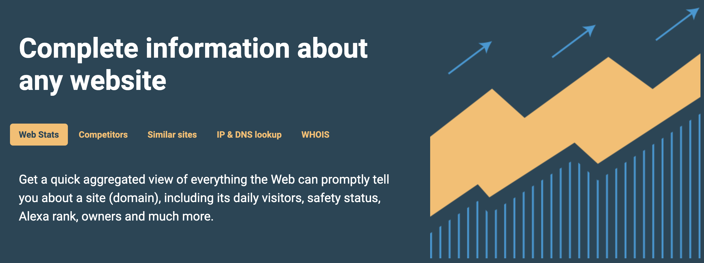
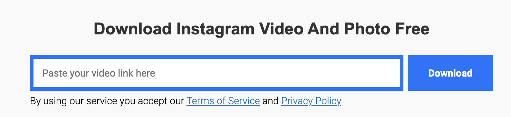
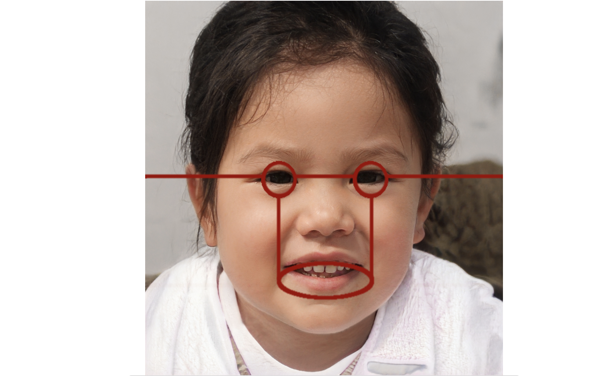
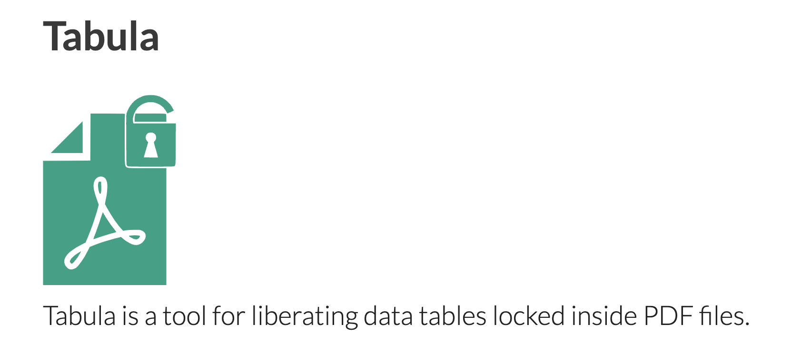
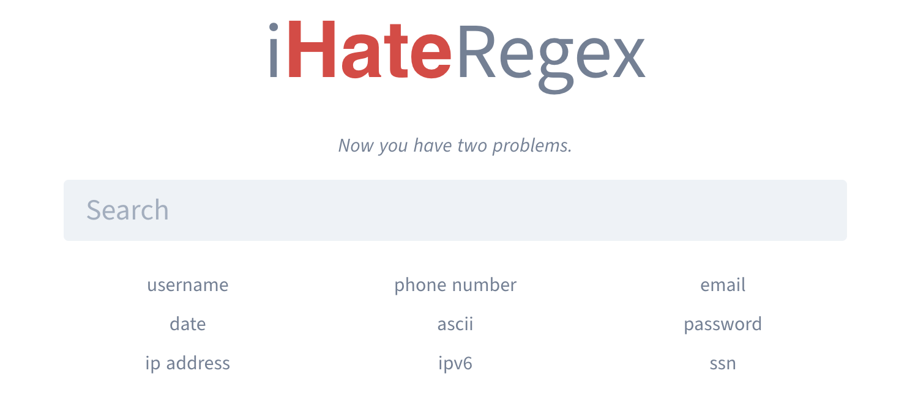
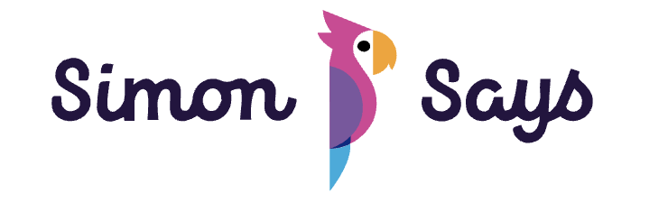
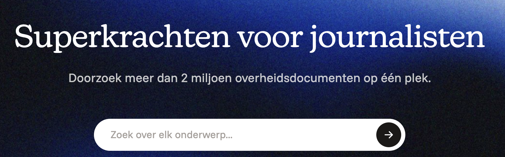
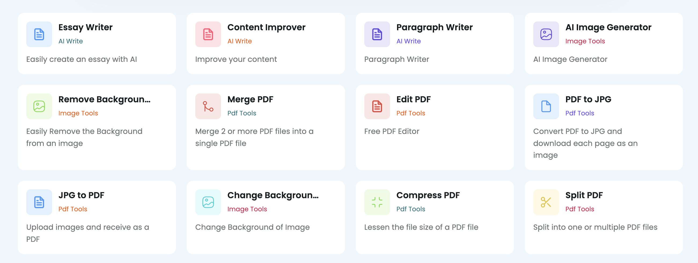

## Met deze **121** tools kun jij een luie (lees: <mark>efficiënte</mark>, <mark>doelgerichte</mark> en <mark>innovatieve</mark>) journalist worden

**Tools**: **[Zoekmachines](#zoekmachines)** • **[Email & Telefoon](#emailphone)** • **[Usernames](#usernames)** • **[Websites & Domeinen](#websites)** • **[Sociale Media](#social)**: *[Facebook](#fb)* • *[Instagram](#insta)* • *[Telegram](#telegram)* • *[YouTube](#youtube)* • *[TikTok](#tiktok)* • *[Reddit](#reddit)* • *[Discord](#discord)* • *[Bluesky](#bluesky)* • *[X (voorheen Twitter)](#twitter)* • *[LinkedIn](#linkedin)* • *[Mastodon](#mastodon)* • *[Threads](#threads)* • **[Verificatie](#verificatie)** • **[Archiveren](#archiveren)** • **[Data](#data)**: *[Verzamelen](#verzamelen)* • *[Bewerken](#bewerken)* • *[Visualiseren](#visualiseren)* • **[AI](#ai)** • **[Crypto](#crypto)** • **[Overig](#overig)** • **[Tutorials](#tutorials)**

*"Ken je nog een tooltje voor...", is een van de meest gestelde vragen onder journalisten, onderzoekers en iedereen die nieuwsgierig is. Iedereen wil <mark>meer, beter en efficiënter</mark> onderzoek doen. Eigenlijk moet je jezelf de vraag stellen: "Hoe kan ik een luie journalist worden?"*

*Nee, natuurlijk zijn journalisten niet lui. Maar we kunnen wel iets leren van luie mensen. Hoe kun je iemand – of in dit geval, iets – anders <mark>het zware werk laten doen</mark>? Deze site helpt je daarbij. Hieronder vind je websites, scripts en apps die technisch ingewikkeld en tijdrovend werk voor je kunnen opknappen.*

*Reminder: tools zijn niets waard zonder te begrijpen hoe ze werken. Het is enkel een <mark>shortcut voor handmatig werk</mark>. Dus vertrouw de resultaten uit zo'n tool niet zonder te snappen wat er onder de motorkap plaatsvindt. En onthoud: <mark>don't be evil</mark>. Je kunt alle tools inzetten voor goede, maar ook voor kwade bedoelingen.*

*Luiejournalist.nl is gemaakt door data- en onderzoeksjournalist Jerry Vermanen. Heb je een goede toevoeging aan deze site? Of wil je een bedankje sturen? [Check onderaan deze pagina hoe je met mij in contact kunt komen ⬇](#einde)*

### <i class="fa fa-search" aria-hidden="true"></i> Zoekmachines
Je bent natuurlijk allang bekend met alle grote zoekmachines, zoals [Google](https://www.google.com/){:target="_blank"}, [Bing](https://www.bing.com/){:target="_blank"}, <a href="https://yandex.com/" target="_blank">Yandex</a> en <a href="https://duckduckgo.com/" target="_blank">DuckDuckGo</a>. Met onderstaande gespecialiseerde zoekmachines kun je nog dieper in het web duiken.

##### <a href="https://www.delpher.nl/" target="_blank">Delpher</a> | <mark>Website</mark>

Ruim twee miljoen kranten van 1618 tot 1995, en honderdduizenden boeken en tijdschriften: eigenlijk moet zoeken in Delpher in de meeste onderzoeken je allereerste stap zijn. Ik heb al zo vaak toffe vondsten gedaan in dit archief.

##### <a href="https://e-justice.europa.eu/content_find_a_company-489-en.do" target="_blank">E-justice Business Register</a> | <mark>Website</mark>

In dit register kun je internationaal zoeken in de Kamers Van Koophandel van alle EU-landen. Toegegeven, deze site is waanzinnig traag. Maar het is nog altijd beter dan je weg proberen te vinden op de Poolse KVK-site.

##### <a href="https://haveibeenpwned.com/" target="_blank">HaveIBeenPownd</a> | <mark>Website</mark>

Op deze site kun je checken of een emailadres in een datalek voorkomt. Handig om je eigen digitale veiligheid te checken, maar ook om te controleren of een mailadres daadwerkelijk gebruikt wordt. Voor telefoonnummers kun je checken of ze in de <a href="https://nos.nl/artikel/2375266-gegevens-van-honderden-miljoenen-facebookgebruikers-op-hackersforum-gedeeld" target="_blank">Facebook Data Breach</a> hebben gestaan.

##### <a href="https://www.shodan.io/" target="_blank">Shodan</a> | <mark>Website</mark>

Shodan is de zoekmachine voor apparaten die aan het internet zijn verbonden: het zogeheten Internet of Things (IoT). <a href="https://github.com/lothos612/shodan" target="_blank">Check ook deze pagina</a> om slimme zoekopdrachten (dorks) te formuleren.

##### <a href="https://www.social-searcher.com/" target="_blank">SocialSearcher</a> | <mark>Website</mark>

SocialSearcher is een zoekmachine waarmee je o.a. in de openbare comments van Reddit, YouTube, Facebook en VKontakte kunt zoeken.

**[terug naar overzicht ⬆](#)**

### <i class="fa fa-envelope" aria-hidden="true"></i> Email & Telefoon
Het startpunt van veel online onderzoeken: een anoniem mailadres of telefoonnummer. Meestal wil je weten wie zich daarachter verschuilt. Deze tools kunnen je daarbij helpen.

##### <a href="https://epieos.com/" target="_blank">Epieos</a> | <mark>Website</mark>

Op Epieos kun je checken waar specifieke telefoonnummers en mailadressen worden gebruikt. Vooral handig als je een Google-accounts wil onderzoeken. Een groot deel van de tools zit verborgen achter een betaalde versie, maar via de gratis optie vind je ook veel aanknopingspunten.

##### <a href="https://haveibeenpwned.com/" target="_blank">HaveIBeenPwned</a> | <mark>Website</mark>

Mogelijk ken je HaveIBeenPwned al omdat je jouw eigen mailadres er wel eens in hebt gegooid: je krijgt dan gelijk te zien in welke datalekken jouw gegevens staan. Maar denk eens andersom: je kunt er dus ook mee checken of andere mailadressen erin staan. En als het mailadres van jouw target in een datalek van een paar jaar geleden staat, dan is het waarschijnlijk geen wegwerp-mailadres (en kun je er misschien veel andere leads uit halen).

##### <a href="https://github.com/megadose/holehe" target="_blank">Holehe</a> | <mark>Script</mark>

Met Holehe kun je checken of een emailadres is geregistreerd op meer dan 50 websites. Bij sommige sites krijg je ook info over het account zelf.

##### <a href="https://github.com/AzizKpln/Moriarty-Project" target="_blank">Moriarty</a> | <mark>Script</mark>

Met Moriarty kun je checken of een telefoonnummer bekend staat als dubieus. Ook wordt gezocht of er socialmedia-accounts aan dit nummer zijn gekoppeld.

##### <a href="https://osint.industries/" target="_blank">OSINT.industries</a> | <mark>Website</mark>

Op OSINT.Industries kun je (grotendeels betaald) rondzoeken op welke websites specifieke mailadressen en telefoonnummers staan geregistreerd. Onderzoeksjournalisten kunnen <a href="https://osint.industries/journalist" target="_blank">een gratis account aanvragen</a>.

##### <a href="https://github.com/sundowndev/phoneinfoga" target="_blank">PhoneInfoga</a> | <mark>Script</mark>

Met PhoneInfoga kun je opzoeken of een telefoonnummer bestaat en welke basisgegevens daarover te vinden zijn. Ook kun je checken aan welke accounts dat nummer is gekoppeld.

##### <a href="https://github.com/jakecreps/poastal" target="_blank">Poastal</a> | <mark>Script</mark>

Met Poastal lanceer je een zoekmachine in je browser waarmee je kunt uitzoeken of een mailadres geregistreerd staat bij specifieke sociale media. Daarnaast kun je uitzoeken of een mailadres überhaupt bestaat, mail kan ontvangen en bekendstaat als spam.

##### <a href="https://temp-mail.org/" target="_blank">Temp Mail</a> | <mark>Website</mark>

Voor sommige researchklussen wil je niet je echte mailadres gebruiken. Je moet een verificatiecode krijgen voor een dubieuze site of moet snel een anonieme mail sturen. Kijk dan zeker even naar Temp Mail. Op deze site kun je tijdelijke mailadressen genereren. Ze bieden ook een service aan genaamd Temp Number voor een telefoonnummer, maar die kost geld.

**[terug naar overzicht ⬆](#)**

### <i class="fa fa-user" aria-hidden="true"></i> Usernames
Stel, je komt tijdens je onderzoek het anonieme account <code>droge_poepsteek</code> tegen. Loopt het spoor dan dood? Met deze tools kun je alsnog aanknopingspunten vinden.

##### <a href="https://github.com/soxoj/maigret" target="_blank">Maigret</a> | <mark>Script</mark>

Met Maigret kun je opzoeken of een username op een websites is geregistreerd. Het is een zeer uitgebreide versie van Sherlock (hieronder te vinden), maar daardoor ook een stuk trager. Je kunt Maigret ook gebruiken in Telegram via het account <a href="https://t.me/osint_maigret_bot" target="_blank">@osint_maigret_bot</a>.

##### <a href="https://github.com/sherlock-project/sherlock" target="_blank">Sherlock</a> | <mark>Script</mark>

Met Sherlock kun je checken of een username op bepaalde sites is geregistreerd. Een snellere, maar ook iets minder uitgebreide versie van Maigret.

##### <a href="https://whatsmyname.app/" target="_blank">WhatsMyName</a> | <mark>Website</mark>

Op WhatsMyName.app kun je snel op bijna 600 websites zoeken of die username staat geregistreerd. Je kunt het resultaat direct exporteren als csv-bestand.

**[terug naar overzicht ⬆](#)**

### <i class="fa fa-globe" aria-hidden="true"></i> Websites & Domeinen
Online websites, de digitale snelweg, het wereldwijde web: je komt er nog eens wat tegen. Zodra je onderzoek moet doen naar een website of domeinnaam, dan kun je onderstaande tools goed gebruiken.

##### <a href="https://analyzeid.com/" target="_blank">Analyze ID</a> | <mark>Website</mark>

Met Analyze ID kun je onderzoeken welke websites van dezelfde eigenaar zijn op basis van email, Facebook ID’s, Adsense, Google Analytics en IP-adres.

##### <a href="https://themarkup.org/blacklight" target="_blank">Blacklight</a> | <mark>Website</mark>

Met Blacklight van <a href="https://themarkup.org/" target="_blank">The Markup</a> kun je analyseren hoe je op diverse websites wordt gevolgd door cookies, ad trackers, Google Ads, etc.

##### <a href="https://builtwith.com/" target="_blank">BuildWith</a> | <mark>Website</mark>

Met BuildWith kun je snel checken wat de onderliggende techniek van een website is.

##### <a href="https://dnslytics.com/" target="_blank">DNSlytics</a> | <mark>Website</mark>

Met DNSlytics kun je snel een overzicht krijgen van alle kenmerken van een website: IP, servers, mailservers, redirects, etc.

##### <a href="https://viewdns.info/" target="_blank">ViewDNS</a> | <mark>Website</mark>

Op ViewDNS staan verschillende modules waarmee je websites kunt analyseren. Het meest nuttig zijn:
* Reverse IP Lookup → Staan op dit domein / IP meerdere websites gehost?
* Reverse WHOIS Lookup → Staan op dit mailadres nog meer websites geregistreerd?

##### <a href="https://visualping.io/" target="_blank">Visualping</a> | <mark>Website</mark>

Als je wil weten wanneer een website verandert, dan kun je dat op Visualping in de gaten houden. Je krijgt een alert via de mail wanneer de website is gewijzigd.

##### <a href="https://website.informer.com/" target="_blank">WebsiteInformer</a> | <mark>Website</mark>

Op Website Informer kun je snel zien wie de eigenaar van een website is. Deze dienst lijkt ook veel resultaten uit het verleden te geven.

##### <a href="https://well-known.dev/" target="_blank">Well-Known</a> | <mark>Website</mark>

Op Well-Known kun je zoeken naar de ads.txt op een website: het overzicht van advertenties dat op die site wordt vertoond. Zodra je inlogt, kun je verder zoeken op de directe adverteerders en websites die dezelfde Google Ads-codes gebruiken.

##### <a href="https://whois-history.whoisxmlapi.com/" target="_blank">WHOIS History</a> | <mark>Website</mark>

Via deze site kun je in historische WHOIS-registraties zoeken naar de eigenaar van een domeinnaam. Heeft wel een limiet, dus spaarzaam gebruiken.

##### <a href="https://www.whoxy.com/" target="_blank">Whoxy</a> | <mark>Website</mark>

Op Whoxy kun je zoeken op welke naam of mailadres een website staat geregistreerd.

**[terug naar overzicht ⬆](#)**

### <i class="fa fa-share" aria-hidden="true"></i> Sociale Media
Grote kans dat elk online onderzoek op een gegeven moment uitkomt bij een sociaal medium. Hieronder vind je de grootste, bekendste of opkomende platforms.

#### Facebook
Facebook doet al jarenlang zijn best om allerlei ontwikkelde tools voor onderzoekers en journalisten onbruikbaar te maken. Ondanks dat zijn er genoeg mogelijkheden om de stroom aan mis- en desinformatie op deze site te onderzoeken.

##### <a href="https://github.com/n0kovo/fb_friend_list_scraper" target="_blank">Facebook Friend List Scraper</a> | <mark>Scraper</mark>

Met de FB Friend List Scraper kun je de vrienden van openbare Facebookprofielen scrapen.

##### <a href="https://fdown.net/" target="_blank">FDown</a> | <mark>Website</mark>

Met FDown kun je snel openbare Facebook-video’s downloaden.

##### <a href="https://lookup-id.com/" target="_blank">Lookup ID</a> | <mark>Website</mark>

Met Lookup.id kun je de ID-code van een Facebook-profiel vinden. Voor sommige andere zoekdiensten (die staan hieronder vermeld) kan die ID-code handig zijn.

##### <a href="https://www.sowsearch.info/" target="_blank">SowSearch</a> | <mark>Website</mark>

Met SowSearch kun je grotendeels zoeken zoals je dat eerder kon met Graph Search. Vooral handig als je complexe zoekopdrachten wil formuleren.

##### <a href="https://whopostedwhat.com/" target="_blank">Who Posted What</a> | <mark>Website</mark>

Met WhoPostedWhat kun je uitgebreid zoeken in openbare posts op Facebook. Hiervoor heb je vaak een ID-code nodig (zie hierboven bij Lookup ID).

**[terug naar overzicht ⬆](#)**

#### Instagram
Heb je een bloedhekel aan Facebook, maar wil je wel dat ome Zuckerberg jouw privacy schendt? Dan kun je altijd nog een Instagram-account aanmaken.

##### <a href="https://imginn.io/" target="_blank">IMGinn</a> | <mark>Website</mark>

Op IMGinn kun je de profielnaam van een openbaar profiel opgeven en direct de afbeeldingen en video’s downloaden.

##### <a href="https://github.com/sc1341/InstagramOSINT" target="_blank">InstagramOSINT</a> | <mark>Scraper</mark>

Met deze tool kun je een specifiek Instagram-account volledig analyseren en scrapen.

##### <a href="https://github.com/instaloader/instaloader" target="_blank">Instaloader</a> | <mark>Scraper</mark>

Met dit script kun je een volledig Instagram-profiel (inclusief comments, hashtags, captions, etc.) downloaden.

##### <a href="https://snapinsta.app/" target="_blank">SnapInsta</a> | <mark>Website</mark>

Met SnapInsta kun je vrij eenvoudig video’s, reels, foto’s, stories en IGTV downloaden.

##### <a href="https://github.com/megadose/toutatis" target="_blank">Toutatis</a> | <mark>Script</mark>

Met Toutatis kun je meer informatie vinden over het (gedeeltelijke) telefoonnummer en emailadres dat is gebruikt om een Instagram-account aan te maken.

**[terug naar overzicht ⬆](#)**

#### Telegram
Ook wel het 'Whatsapp van Oost-Europa' genoemd. De afgelopen jaren duiken steeds meer dubieuze groepen op in Telegram. Dat maakt het voor journalisten en onderzoekers een perfecte grabbelton voor nieuwe onderwerpen.

##### <a href="https://github.com/bellingcat/telegram-phone-number-checker" target="_blank">Bellingcat Phonenumber Check</a> | <mark>Script</mark>

Met dit script (geschreven door <a href="https://www.bellingcat.com/" target="_blank">Bellingcat</a>) kun je checken of een telefoonnummer is gekoppeld aan een Telegram-account.

##### <a href="https://github.com/danog/MadelineProto/" target="_blank">MadelineProto</a> | <mark>Scraper</mark>

Script om de Telegram-API mee aan te spreken. Handig om scrapers mee te maken, maar je moet nog wel zelf flink wat programmeren.

##### <a href="https://github.com/pigpagnet/save-telegram-chat-history" target="_blank">Save Telegram Chat History</a> | <mark>Plugin</mark>

Met deze Chrome-plugin kun je de volledige geschiedenis van een kanaal of groep downloaden. Je moet echter wel de oude interface van Telegram gebruiken. Om dat te doen, voeg je <code>?legacy=1</code> achter de url web.telegram.org. Het is niet ideaal (duurt lang, en veel moderne mediaberichten worden niet binnengehaald), maar voor tekstanalyse is het uitstekend.

##### <a href="https://www.tampermonkey.net/" target="_blank">Tampermonkey + Download Users</a> | <mark>Plugin</mark>

<a href="https://www.tampermonkey.net/" target="_blank">Tampermonkey</a> is een browser-plugin waarin je zelf code kunt toevoegen nieuwe functionaliteit in je browser mogelijk te maken. <a href="https://gist.github.com/fabledowl/8c8db5858e096866c42dfa114034f0f2/raw/getUsers.user.js
" target="_blank">En met dit script</a> krijg je voor de webversie van Telegram een downloadknop om de leden van Telegram-groepen en -kanalen te downloaden. Hiervoor moet je wel in de oude versie van Telegram werken. Om dat te doen, voeg je <code>?legacy=1</code> achter de url web.telegram.org.

##### <a href="https://github.com/unnohwn/telegram-scraper" target="_blank">Telegram Group Scraper</a> | <mark>Scraper</mark>

Heeft aardig wat setup nodig (let er vooral op dat je het exacte ID-nummer invoert van de Telegram-groepen), maar het eenmaal werkt kun je alle groepen scrapen die je wil. Het mooiste is dat je een continue scrape kunt aanzetten:  elk nieuwe bericht wordt dan direct binnengehaald.

##### Telegram zoekmachines | <mark>Website</mark>

Op deze sites kun je door gearchiveerde Telegram-groepen en -kanalen zoeken. Handig om onderwerpen in te vinden. Je kunt door de volgende sites struinen:
* <a href="https://tgstat.com/" target="_blank">Tgstat</a>
* <a href="https://telemetr.me/" target="_blank">Telemetr.me</a>
* <a href="https://telemetr.io/" target="_blank">Telemetr.io</a>
* <a href="https://lyzem.com/" target="_blank">Lyzem</a>
* <a href="https://tgramsearch.com/" target="_blank">Tgramsearch</a>
* <a href="https://cse.google.com/cse?cx=6c3e0c0d3da8e3b4a" target="_blank">Telegago</a>

**[terug naar overzicht ⬆](#)**

#### YouTube
Ooit, lang geleden, was YouTube nog een site waar korte vlogs en kattenfilmpjes werden gepost. Nu kun je er urenlange podcasts, uitgebreide documentaires en de brainfarts van je geradicaliseerde buurjongen vinden.

##### <a href="https://filmot.com/" target="_blank">Filmot</a> | <mark>Website</mark>

Met Filmot kun je door de ondertitels van 1,5 miljard YouTube-video's zoeken. Enorm handig als je specifieke steekwoorden hebt om op te zoeken (en bizar dat YouTube zelf geen optie heeft om dit te doen).

##### <a href="http://www.watchframebyframe.com/" target="_blank">Watch Frame By Frame</a> | <mark>Website</mark>

Met Watch Frame By Frame kun je YouTube-video’s per frame bekijken. Erg handig als je een specifiek frame nodig hebt voor je onderzoek.

##### <a href="https://github.com/egbertbouman/youtube-comment-downloader" target="_blank">YouTube Comment Downloader</a> | <mark>Scraper</mark>

Met deze scraper kun je de comments van een YouTube-video downloader, inclusief alle metadata daar omheen (datum, aantal duimpjes omhoog, profielnaam, link naar profielfoto, etc.).

##### <a href="https://github.com/jdepoix/youtube-transcript-api" target="_blank">YouTube Transcript / Subtitle API</a> | <mark>Scraper</mark>

Met dit script kun je de transcripten (inclusief vertalingen) van YouTube-video’s scrapen.

##### <a href="https://chrome.google.com/webstore/detail/youtube-word-searcher/jichoejagacnbcinlgncghhdegdlhbcj/related" target="_blank">YouTube Word Searcher</a> | <mark>Plugin</mark>

Met deze Chrome plugin kun je zoeken naar specifieke woorden in een YouTube-video. Je kunt gelijk naar de tijdcode scrollen waarop dat woord wordt gezegd. Werkt alleen zodra er een ondertitelbestand is toegevoegd aan de video.

##### <a href="https://github.com/yt-dlp/yt-dlp" target="_blank">YouTube-dlp</a> | <mark>Scraper</mark>

Met YouTube-dlp kun je binnen no-time via de terminal YouTube-video’s (en beeldmateriaal van talloze andere websites) downloaden.

**[terug naar overzicht ⬆](#)**

#### TikTok
Een oneindige feed vol korte video’s: TikTok is extreem verslavend en enorm interessant om te onderzoeken. Er zijn helaas nog niet veel tools die (blijven) werken voor dit platform.

##### <a href="https://ads.tiktok.com/business/creativecenter" target="_blank">TikTok Creative Center</a> | <mark>Website</mark>

Eigenlijk is het TikTok Creative Center voor adverteerders bedoeld om te zien wat trending is. Maar journalisten kunnen hier ook gebruik van maken om te zien welke onderwerpen er op het platform spelen.

##### <a href="https://tiktokdownloader.com/" target="_blank">TikTok Downloader</a> | <mark>Website</mark>

Met de TikTok Downloader kun je TikTok-video’s snel en zonder watermerk downloaden. Ze hebben zelfs <a href="https://chromewebstore.google.com/detail/tiktok-downloader/ghhcamahihkbgfioeimocdmmiiejjnfe" target="_blank">een handige Chrome plugin</a> als je nog eenvoudiger video’s wil binnenhalen.

**[terug naar overzicht ⬆](#)**

#### Reddit
Een van de weinige online forums waar je intelligente en doordachte gesprekken kunt aantreffen. En natuurlijk veel kattenmemes.

##### <a href="https://f5bot.com/" target="_blank">F5Bot</a> | <mark>Website</mark>

Met F5Bot kun je custom alerts opzetten voor Reddit. Laat jezelf mailen zodra een specifiek steekwoord wordt gepost.

##### <a href="http://karmadecay.com/" target="_blank">Karma Decay</a> | <mark>Website</mark>

Reversed Image Search om gelijksoortige of identieke afbeeldingen op Reddit te vinden.

##### <a href="https://kerrick.github.io/Mostly-Harmless" target="_blank">Mostly Harmless</a> | <mark>Plugin</mark>

Mostly Harmless is een browser plugin waarmee je kunt zien of een url al op Reddit is gedeeld. Zo ja, dan kun je direct het gesprek rondom dat artikel bekijken. Via de site moet je de instructies op [de download-pagina volgen](https://kerrick.github.io/Mostly-Harmless/#download){:target="_blank"}, omdat de plugin uit de Chrome Store is verwijderd.

##### <a href="https://reddit-user-analyser.netlify.app/" target="_blank">Reddit User Analyser</a> | <mark>Website</mark>

Met Reddit User Analyser kun je alle statistieken van een Reddit-account bekijken.

##### <a href="https://www.resavr.com/" target="_blank">Resavr</a> | <mark>Website</mark>

Op Resavr kun je veel verwijderde comments op Reddit weer terugvinden.

##### <a href="https://github.com/JosephLai241/URS" target="_blank">Universal Reddit Scraper</a> | <mark>Scraper</mark>

Universal Reddit Scraper (URS) heeft een uitgebreide interface waarin je kunt aangeven wat je precies van Reddit wil binnenhalen. Je kunt subreddits, accounts en comments scrapen.

**[terug naar overzicht ⬆](#)**

#### Discord
Discord begon als dienst om te voicechatten tijdens games. Tegenwoordig kun je hier veel verschillende communities vinden. De voiceberichten maken het misschien wat lastig om te onderzoeken, maar op Discord kun je ook veel geschreven berichten vinden.

##### <a href="https://disboard.org/servers" target="_blank">Disboard</a> | <mark>Website</mark>

Via deze site kun je zoeken naar openbare Discord-servers. Een handig beginpunt als je nog nooit eerder op Discord bent geweest.

##### <a href="https://dht.chylex.com/" target="_blank">Discord History Checker</a> | <mark>Software</mark>

Met deze software kun je de volledige gespreksgeschiedenis van servers, groepen en DM’s downloaden.

##### <a href="https://hugo.moe/discord/discord-id-creation-date.html" target="_blank">Discord ID Creation Date Checker</a> | <mark>Website</mark>

Met deze site kun je checken op welke datum een Discord-account is aangemaakt.

##### <a href="https://discordleaks.unicornriot.ninja/discord/server/" target="_blank">DiscordLeaks</a> | <mark>Website</mark>

Zoek in 100 duizenden gelekte extremistische Discord-gesprekken.

**[terug naar overzicht ⬆](#)**

#### Bluesky
Op Bluesky ervaar je het Twitter-gevoel voordat Twitter een platform voor misinformatie, extremisten en blaaskaken werd.

##### <a href="https://bsvdl.fly.dev/" target="_blank">Bluesky Video Downloader</a> | <mark>Website</mark>

Download video's die je op Bluesky bent tegengekomen.

##### <a href="https://deck.blue/" target="_blank">Deck Blue</a> | <mark>Website</mark>

Met Deck Blue kun je al je mentions, lijsten en zoektermen in meerdere kolommen volgen.

##### <a href="https://twexit.nl/profile/" target="_blank">Twexit for Bluesky</a> | <mark>Website</mark>

Beetje verwarrende naam, maar op deze site kun je snel wat statistieken voor Bluesky-profielen bekijken.

**[terug naar overzicht ⬆](#)**

Voor de onderstaande sociale media zijn tools onbruikbaar geworden of nog niet ontwikkeld. Heb je toch data nodig van deze websites? Mogelijk vind je nog iets nuttigs in de sectie <a href="https://luiejournalist.nl/#verzamelen" target="_blank">Data Verzamelen</a>.

#### X (voorheen Twitter)
Sinds  Elon Musk de baas werd, zijn bijna alle tools onbruikbaar geworden. Toch houd ik deze sectie op de site. Waarschijnlijk tegen beter weten in.

#### LinkedIn
Ooit begonnen als online CV-site, momenteel een slappe feed vol 'inspirerende' ervaringen van saaie mensen. Alsnog een goede bron van informatie, maar ik ken geen nuttige websites of tools voor LinkedIn.

#### Mastodon
Een Mastodon-account maken is een intens twijfelachtig proces: begrijp maar eens op welke server je je moet aanmelden. Vervolgens kom je op een platform waar - voor zover ik weet - nog geen nuttige tools voor zijn ontwikkeld.

#### Threads
Mark Zuckerberg heeft een nieuwe manier gevonden waarmee hij democratieën wil ondermijnen: Threads. Op dit moment is het nog gezellig en vriendelijk op deze Twitter-kloon, maar zoals alle sociale media is het slechts een kwestie van tijd voordat het he-le-maal misgaat. Op dit moment ken ik nog geen goede tools om Threads te onderzoeken.

**[terug naar overzicht ⬆](#)**

### <i class="fa fa-check" aria-hidden="true"></i> Verificatie
Spoiler: niet alles wat je online vindt, is waar. Wil je weten of een video authentiek is of een persoon wel echt bestaat? Onderstaande tools kunnen je daarbij helpen.

##### <a href="https://seintpl.github.io/AmIReal/" target="_blank">Am I Real</a> | <mark>Website</mark>

Door de website <a href="https://thispersondoesnotexist.com/" target="_blank">ThisPersonDoesNotExist</a> zwermen er talloze nepfoto's van personen over het internet. Met deze site kun je checken of ze van die site afkomstig zijn.

##### <a href="https://aws.amazon.com/getting-started/hands-on/detect-analyze-compare-faces-rekognition/" target="_blank">Amazon Rekognition</a> | <mark>Website</mark>

Hoeveel lijken twee gezichten op elkaar? Handig als je een persoon zoekt en twee foto’s met elkaar moet vergelijken.

##### <a href="https://exif.tools/" target="_blank">EXIF.tools</a> | <mark>Website</mark>

Een foto is niet alleen een plaatje: in de zogeheten EXIF-file worden ook gegevens opgeslagen zoals resolutie, locatie en met welke camera een foto is gemaakt. Dat kan dus waardevolle informatie bevatten als je weet hoe je die informatie kunt inzien. <a href="https://exif.tools/" target="_blank">EXIF.tools</a> is de online variant van de tools die op <a href="https://exiftool.org/" target="_blank">exiftool.org</a> staan. 

##### <a href="https://fotoforensics.com/" target="_blank">FotoForensics</a> | <mark>Website</mark>

Een spuuglelijke site met dito logo, maar je kunt veel verborgen gegevens (waaronder de EXIF-file) van een afbeelding bekijken met <a href="https://fotoforensics.com/" target="_blank">FotoForensics</a>.

##### <a href="https://facecheck.id/" target="_blank">Facecheck.id</a> | <mark>Website</mark>

Facecheck.id zoekt met gezichtherkenning waar een persoon nog meer voorkomt. Helaas moet je sinds 1 maart 2024 betalen voor deze service (maar je krijgt wel 5 gratis searches).

##### <a href="https://www.findthatspot.io/" target="_blank">Find That Spot</a> | <mark>Website</mark>

Moet je een exacte locatie vinden, maar voel je je ook een beetje lui? Gebruik dan Find That Spot. Omschrijf welke locatie je probeert te zoeken via de chatbot, en Find That Spot gaat vervolgens voor je zoeken naar locaties die aan deze beschrijving voldoen

##### <a href="https://geospy.web.app/" target="_blank">Geospy</a> | <mark>Website</mark>

Voordat je urenlang op Google Maps gaat rondspeuren om de exacte locatie van een foto te verifiëren, kun je een snelle zoektocht doen met Geospy. Deze site kijkt naar de unieke contouren en gebouwen op je afbeelding en zoekt door talloze services om je (inclusief een onzekerheidsmarge) de coördinaten te geven.

##### <a href="https://toolbox.google.com/factcheck/explorer" target="_blank">Google Factcheck Explorer</a> | <mark>Website</mark>

Dagelijks zijn duizenden factcheckers bezig om afbeeldingen en artikelen te controleren. Dus zodra je iets moet verifiëren, dan kun je het beste eerst even in de Google Factcheck Explorer rondzoeken. Grote kans dat iemand je al is voorgeweest. <a href="https://blog.google/products/search/google-search-new-fact-checking-features/" target="_blank">Op deze pagina van Google</a> vind je overigens nog meer manieren waarop je kunt checken of een foto is gemanipuleerd.

##### <a href="https://mever.iti.gr/forensics/" target="_blank">Image Verification Assistant</a> | <mark>Website</mark>

Met de Image Verification Assistant kun je analyseren of beeldmateriaal is gemanipuleerd. Ook zijn er talloze voorbeelden te vinden van gemanipuleerde afbeeldingen.

##### <a href="https://weverify.eu/verification-plugin/" target="_blank">InVID WeVerify</a> | <mark>Plugin</mark>

Enorm handige plugin waarmee je direct via Google, Yandex en Baidu Reversed Image Search kunt doen. Inclusief een aantal handige tools om fotomanipulatie mee te analyseren.

##### <a href="https://www.metadata2go.com/" target="_blank">Metadata2Go</a> | <mark>Website</mark>

Op Metadata2Go kun je snel de metadata van je afbeeldingen analyseren.

##### <a href="https://overpass-turbo.eu/" target="_blank">Overpass Turbo</a> | <mark>Website</mark>

Met Overpass Turbo kun je een zoekopdracht maken om specifieke landmarks op kaarten te ontdekken. Voorbeeld: vind alle onbewaakte spoorwegovergangen in een straal van 500 meter van een windmolen. Erg handig als je OSINT doet: zodra je specifieke aanwijzingen op een afbeelding ziet staan, dan kun je het aantal locaties snel beperken. Overpass Turbo vraagt wel om een zoekopdracht in een hele specifieke taal, maar ChatGPT kan je daar goed mee helpen. Je kunt al je gevonden landmarks exporteren om verder te analyseren in andere software.

Met Overpass Turbo kun je snel een query maken van specifieke landmarks op kaarten. Handig als je OSINT moet doen en specifieke dingen ziet waar je op kunt zoeken. Werkt erg handig als je je query in <a href="https://chat.openai.com/" target="_blank">ChatGPT</a> formuleert. Vervolgens kun je op de kaart zoeken of de locatie overeenkomt met wat je op de foto ziet. Een andere mogelijkheid is het exporteren van de objecten die je via de query hebt gevonden. Kan handig zijn als je in QGIS of R een analyse wil doen.

##### <a href="https://www.peakfinder.com/" target="_blank">Peakfinder</a> | <mark>Website</mark>

Met Peakfinder kun je foto’s geolocaten als daar een heuvel of berg in staat. Zodra je een vermoeden hebt waar het kan zijn, dan kun je die foto op die locatie uploaden en de omtrek van het landschap matchen met je afbeelding.

##### <a href="https://pimeyes.com/" target="_blank">PimEyes</a> | <mark>Website</mark>

Met PimEyes kun je zoeken op dezelfde persoon d.m.v. biometrische gelijkenissen. Let op: dit is een betaalde service.

**[terug naar overzicht ⬆](#)**

### <i class="fa fa-hdd-o" aria-hidden="true"></i> Archiveren
Ze zeggen dat als iets eenmaal online staat, je het nooit meer verwijderd krijgt. Zul je net zien dat wat jij gisteren hebt gevonden tijdens je onderzoek wèl is verdwenen. Daarom is het belangrijk om al je materiaal te archiveren. Hieronder vind je een aantal tools om dat voor elkaar te krijgen.

##### <a href="https://archive.ph/" target="_blank">Archive.today</a> | <mark>Website</mark>

Tijdens je onderzoek kom je online ongelooflijk vaak informatie tegen die op elk moment kan worden verwijderd. Daarom is het een goede gewoonte om die sites op te slaan met een archiveerdienst. [Archive.today](https://archive.ph/){:target="_blank"} is een van de beste diensten op dat gebied. Als alternatief kun je ook de [Wayback Machine](https://archive.org/web/){:target="_blank"} van Archive.org gebruiken. Tip: je kunt ook eerder opgeslagen versies van een website doorzoeken. En let op: deze diensten slaan geen video’s op.

##### <a href="https://github.com/bellingcat/auto-archiver" target="_blank">Bellingcat Auto Archiver</a> | <mark>Script</mark>

Websites, video, tweets: tijdens een doorwrocht onderzoek kom je meerdere soorten informatie tegen. En normaal gesproken heeft elk medium zijn eigen dienst nodig om gearchiveerd te worden. Maar de Bellingcat Auto Archiver belooft alles in één script bij elkaar te rapen. De installatie is enorm frustrerend, langdradig en foutgevoelig, want je hebt ongelooflijk veel extra libraries nodig. Maar als het eenmaal werkt, is het best awesome.

##### <a href="https://cachedview.nl/" target="_blank">CachedView</a> | <mark>Website</mark>

Via archiefdiensten kun je niet alleen websites opslaan, maar ook zoeken naar eerder opgeslagen versies van websites. Op Cachedview kun je via 6 verschillende diensten tegelijk zoeken en een screenshot van die website opvragen. Kan enorm veel tijd schelen.

##### <a href="https://www.forensicosint.com/" target="_blank">Forensic OSINT</a> | <mark>Plugin</mark>

Archiveren betekent ook heel veel screenshots maken. Dan wordt het al snel een onoverzichtelijke bende op je computer. Met deze Chrome-pluging Forensic OSINT kun je screenshots overzichtelijk in allerlei mappen verzamelen. Je bestanden worden ook nog eens automatisch aangevuld met datums, webadressen, etc. Het enige nadeel is dat je moet betalen voor sommige functies.

##### <a href="https://getfireshot.com/" target="_blank">Fireshot</a> | <mark>Plugin</mark>

Een goed alternatief voor Forensic OSINT is de Fireshot plugin. Hiermee kun je screenshots maken van volledige webpagina’s. Handig als je een website wil archiveren of als beeldmateriaal nodig hebt. De website probeert je over te halen om de betaalde pro-versie te nemen, maar met de gratis plugin (voor praktisch elke browser beschikbaar) kom je ook al een heel eind.

##### <a href="https://www.ubikron.com/" target="_blank">Ubikron</a> | <mark>Script</mark>

Met Ubikron kun je jouw online zoektocht naar dat ene cruciale bewijsstuk achteraf reconstrueren. Deze dienst slaat alles op wat in je browser gebeurt. Je kunt screenshots taggen, beschrijven en structureren. Het is vrij briljant dat dit gratis is, want voor vergelijkbare diensten zoals <a href="https://hunch.ly/" target="_blank">Hunchly</a> moet je je portemonnee trekken.

##### <a href="https://chromewebstore.google.com/detail/video-screenshot/ppkojackhibeogijphhfnamhemklmial" target="_blank">Video Screenshot</a> | <mark>Plugin</mark>

Op veel streamingsdiensten kun je geen screenshot maken. Superirritant als je dat beeld nodig hebt voor je onderzoek. Met deze plugin (alleen voor Chrome) krijg je op NPO Start, YouTube, Netflix, etc. een extra icoontje te zien waarmee je alsnog een screenshot kunt maken.

##### <a href="https://archive.org/services/wayback-gsheets/" target="_blank">Wayback Machine + Google Sheets</a> | <mark>Website</mark>

Een van de meest tijdrovende klussen is wanneer je honderden (zo niet duizenden) url's in de Wayback Machine wil opslaan. Dat kun je stuk voor stuk doen, maar je kunt ook overwegen om Wayback Machine en Google Sheets te combineren. Via deze module kun je alle url's in je Google Sheets opslaan: je spreadsheet wordt gelijk uitgebreid met de archieflink en eventuele foutmeldingen. 

**[terug naar overzicht ⬆](#)**

### <i class="fa fa-table" aria-hidden="true"></i> Data
Datajournalistiek: het allermooiste beroep ter wereld (is mijn geheel objectieve, neutrale en ongekleurde mening). Hier vind je een aantal tools die je kunt gebruiken om next level te gaan.

#### Verzamelen
Zonder data geen datajournalistiek (duh), dus hieronder een aantal websites en plugins waarmee je moeilijk te verkrijgen gegevens alsnog kunt verzamelen.

##### <a href="https://csvjson.com/" target="_blank">CSVJSON</a> | <mark>Website</mark>

Met CSVJSON kun je CSV naar JSON omzetten, en vice versa. Ook kun je JSON beautifyen (leesbaar) maken. Je gegevens worden niet naar een andere server gestuurd.

##### <a href="https://chrome.google.com/webstore/detail/instant-data-scraper/ofaokhiedipichpaobibbnahnkdoiiah" target="_blank">Instant Data Scraper</a> | <mark>Scraper</mark>

Met deze browser plugin voor Chrome kun je eenvoudig data scrapen. De plugin kan zelf inschatten welke gegevens kunnen worden verzameld. Met de autoscoll-functie kun je vervolgens de scraper oneindig laten draaien. Erg handige noodoplossing voor sociale media waar andere scrapers niet (meer) werken, zoals X/Twitter en Bluesky.

##### <a href="https://github.com/JustAnotherArchivist/snscrape" target="_blank">snscrape</a> | <mark>Scraper</mark>

Dit script zegt data te kunnen scrapen van de volgende websites:
* Facebook: user profiles, groups, and communities (aka visitor posts)
* Instagram: user profiles, hashtags, and locations
* Mastodon: user profiles and toots (single or thread)
* Reddit: users, subreddits, and searches (via Pushshift)
* Telegram: Channels
* ~~Twitter: users, user profiles, hashtags, searches (live tweets, top tweets, and users), tweets (single or surrounding thread), list posts, communities, and trends~~
* VKontakte: user profiles
* Weibo (Sina Weibo): user profiles

Omdat dit een tool is die meerdere sociale media zegt te kunnen scrapen, kan het ook eerder stukgaan.

##### <a href="https://tabula.technology/" target="_blank">Tabula</a> | <mark>Software</mark>

Tabula is erg handig zodra je PDF’s met datatabellen erin krijgt. Je kunt visueel aangeven waar de tabel zit, en Tabula doet een goede poging om die gegevens netjes in een CSV te zetten.

##### <a href="https://github.com/tesseract-ocr/tesseract" target="_blank">Tesseract</a> | <mark>Script</mark>

Met Tesseract kun je tekst in afbeeldingen omzetten naar machine-leesbare tekst. Werkt ook voor PDF-bestanden. Met Tesseract zijn inmiddels meerdere toepassingen gemaakt, waaronder <a href="https://cran.r-project.org/web/packages/tesseract/vignettes/intro.html" target="_blank">een package in R</a>.

##### <a href="https://github.com/digitalmethodsinitiative/zeeschuimer" target="_blank">Zeeschuimer + Zeeschuimer Decoder</a> | <mark>Scraper</mark>

Zeeschuimer is een Firefox browser plugin waarmee je tijdens het scrollen op sociale media (Tiktok, Instagram, Twitter, LinkedIn, etc.) data verzamelt. Met de <a href="https://github.com/jorisheijkant/zeeschuimer-decoder" target="_blank">Zeeschuimer Decoder</a> kun je die data omzetten naar een csv-bestand.

**[terug naar overzicht ⬆](#)**

#### Bewerken
Met een spreadsheet kom je een heel eind, maar soms heb je nét een beetje extra nodig om je analyse uit te voeren.

##### <a href="https://openrefine.org/" target="_blank">Open Refine</a> | <mark>Software</mark>

Met Open Refine kun je je data opschonen. Een van de handigste functies in Open Refine is het clusteren van data op naam: bijvoorbeeld bedrijfsnamen die op verschillende manieren worden geschreven.

##### <a href="https://posit.co/download/rstudio-desktop/" target="_blank">R + RStudio</a> | <mark>Software</mark>

Verreweg de beste software om data mee te analyseren. Je kunt in R werken, maar de handigste interface is RStudio. Volg <a href="https://posit.co/download/rstudio-desktop/" target="_blank">het stappenplan op de website</a> om alles in de juiste volgorde te installeren. Codecademy biedt <a href="https://www.codecademy.com/catalog/language/r" target="_blank">een uitstekende beginnerscursus R</a> aan om de programmeertaal onder de knie te krijgen.

##### Regular Expressions | <mark>Script</mark>

Soms zoek je hele specifieke gegevens (telefoonnummers, mailadressen, Bitcoin wallets, etc.) in grote lappen tekst. Dan zijn Regular Expressions (ook wel Regex genoemd) erg handig. Het is toepasbaar in meerdere programmeertalen, maar wel erg lastig te begrijpen. Daarom vind je <a href="https://github.com/niklongstone/regular-expression-cheat-sheet" target="_blank"> in deze cheatsheet</a> wat hulp. Op <a href="https://ihateregex.io/" target="_blank">I Hate Regex</a> kun je werkende Regex vinden die je kunt aanpassen voor jouw specifieke zoekopdracht. En op <a href="https://regex101.com/" target="_blank">Regex101</a> kun je je RegEx testen

**[terug naar overzicht ⬆](#)**

#### Visualiseren
Ten slotte wil je je data mooi presenteren. Dit zijn een aantal websites die ik aanraad om visualisaties mee te maken.

##### <a href="https://www.localfocus.nl/" target="_blank">LocalFocus</a> | <mark>Website</mark>

Met LocalFocus kun je eenvoudige kaarten en grafieken maken. Ook enorm handig: de functionaliteit om gemeentenamen te corrigeren.

##### <a href="https://www.datawrapper.de/" target="_blank">Datawrapper</a> | <mark>Website</mark>

Met Datawrapper kun je kaarten, grafieken en tabellen maken. In vergelijking met LocalFocus iets meer mogelijkheden, maar daardoor ook iets ingewikkelder voor leken.

##### <a href="https://flourish.studio/" target="_blank">Flourish</a> | <mark>Website</mark>

Met Flourish kun je kaarten, grafieken en zogeheten ‘data stories’ (meerdere grafieken achter elkaar met begeleidende tekst) maken. Tussen LocalFocus en Datawrapper de meest uitgebreide, maar ook meest ingewikkelde keuze voor visualisatie. 

**[terug naar overzicht ⬆](#)**

### <i class="fa fa-lightbulb-o" aria-hidden="true"></i> AI
Ik geef toe dat Terminator en The Matrix niet direct de meest positieve voorbeelden zijn van Kunstmatige Intelligentie. Deze films maken in ieder geval duidelijk dat zelfs kwaadaardige AI enorm slim, efficiënt en tijdbesparend kan zijn. Daarom kunnen onderstaande tools jouw werk eenvoudiger maken.

##### <a href="https://chat.openai.com/" target="_blank">ChatGPT</a> | <mark>Website</mark>

ChatGPT is eigenlijk een chatbot die antwoorden genereert op basis van externe informatie. Je kunt hier onwijs veel nuttige dingen mee doen. Voor mij zijn de volgende zaken het nuttigst:

* Queries maken voor <a href="https://overpass-turbo.eu/" target="_blank">Overpass Turbo</a>
* Suggesties voor nieuwskoppen maken
* Teksten voor socialmedia-berichten herschrijven
* Invalshoeken voor onderzoek genereren
* Delen Python-code schrijven voor scrapers

##### <a href="https://cleanup.pictures/" target="_blank">Cleanup Pictures</a> | <mark>Website</mark>

Met Cleanup Pictures kun je foto’s opschonen en objecten verwijderen. Kan handig zijn vlak voordat je een Reversed Image Search doet.

##### <a href="https://www.deepl.com/translator" target="_blank">DeepL</a> | <mark>Website</mark>

DeepL is de beste manier om tekst te vertalen. Zeker in deze volgorde: eerst tekst vertalen via [DeepL Translator](https://www.deepl.com/translator){:target="_blank"} en daarna de tekst grammaticaal verbeteren (of zelfs naar een andere schrijfstijl omzetten) met [DeepL Write](https://www.deepl.com/write){:target="_blank"}.

##### <a href="https://huggingface.co/" target="_blank">Hugging Face</a> | <mark>Website</mark>

Hugging Face is dé plek waar je AI-modellen kunt vinden. In sommige gevallen wordt de trainingsdata meegeleverd.

##### <a href="https://github.com/lobe" target="_blank">Lobe.ai</a> | <mark>Script</mark>

Met Lobe.ai kun je kunstmatige intelligentie trainen om beeldmateriaal te herkennen en te categoriseren. Had eerst een desktop-app, maar is nu alleen nog beschikbaar als script. Voor Pointer heb ik Lobe.ai ooit gebruikt bij een <a href="https://pointer.kro-ncrv.nl/honderden-vrouwelijke-tinder-profielen-proberen-nederlanders-naar-nepdatingsites-te-lokken" target="_blank">onderzoek naar nepprofielen op Tinder</a> (<a href="https://pointer.kro-ncrv.nl/hoe-we-een-computer-hebben-leren-tinderen-om-nepprofielen-te-herkennen" target="_blank">hier lees je hoe ik dat heb gedaan</a>).

##### <a href="http://www.macwhisper.com/" target="_blank">MacWhisper</a> | <mark>Software</mark>

Met MacWhisper (voor Macbooks) kun je hele goede transcripties maken van je audiobestanden, inclusief tijdcodes. Alle data blijft op je lokale machine staan. En sinds kort kun je via de zogeheten Whisperkit-taalmodellen ook sprekersherkenning gebruiken. Ik raad aan om de Pro-versie voor 29 euro te nemen: de taalmodellen die hierin worden gebruikt zijn nagenoeg foutloos. Journalisten kunnen 50 procent korting krijgen. [Ga naar de site](http://www.macwhisper.com/){:target="_blank"} en vermeld kortingscode <code>LUIEJOURNALIST</code> bij het afrekenen.

##### <a href="https://www.midjourney.com" target="_blank">Midjourney</a> | <mark>Website</mark>

Simpelweg de beste methode om AI-gegenereerde afbeeldingen mee te maken. Via [de Discord-server van Midjourney](https://discord.com/invite/midjourney){:target="_blank"} kun je (zowel betaald als gratis) afbeeldingen maken via tekstprompts. Alternatieven voor Midjourney zijn [Ideogram](https://ideogram.ai){:target="_blank"} en [Adobe Firefly](https://firefly.adobe.com/inspire/images){:target="_blank"}.

##### <a href="https://remini.ai/" target="_blank">Remini</a> | <mark>Website</mark>

Met Remini kun je foto’s van slechte kwaliteit met AI verbeteren. Let op: als je dit wil gebruiken om beeldmateriaal via te Reversed Image Searchen of verifiëren, dan is het resultaat dus iets onbetrouwbaarder.

##### <a href="https://www.remove.bg/" target="_blank">RemoveBG</a> | <mark>Website</mark>

Met RemoveBG (lees: Remove Background) kun je snel en eenvoudig de achtergrond van afbeeldingen verwijderen.

##### <a href="https://www.simonsaysai.com" target="_blank">Simon Says</a> | <mark>Website</mark>

Een van de beste manieren om beeldmateriaal mee te transcriberen. Je transcript wordt ook nog eens met het beeld gesynchroniseerd. Je kunt zelfs ruwe montages maken als je de getranscribeerde tekst gaat editten. Je krijgt gratis credits om beeldmateriaal te transcriberen, maar die zijn snel op.

##### <a href="https://teachablemachine.withgoogle.com/" target="_blank">Teachable Machine</a> | <mark>Website</mark>

Als je geen zin hebt om in code te gaan rondklooien (zoals bij Lobe.ai), dan is Teachable Machine wellicht iets voor je. Hiermee kun je relatief snel via een web-interface een model trainen om afbeeldingen te herkennen. Werkt verrassend goed, alleen wordt het ingewikkeld en traag zodra je duizenden afbeeldingen wil gaan classificeren.

**[terug naar overzicht ⬆](#)**

### <i class="fa fa-btc" aria-hidden="true"></i> Crypto
Ah, de toekomst van ons betalingsverkeer: gedecentraliseerd, gepseudonimiseerd en encrypted. En vooral gebruikt door crypto-bro’s en georganiseerde misdaad. Daarom zijn onderstaande tools handig om zulke dubieuze transacties inzichtelijk te maken.

##### <a href="https://www.bitcoinwhoswho.com/" target="_blank">BitcoinWhosWho</a> | <mark>Website</mark>

Op BitcoinWhoswho kun je checken of een wallet of transactie bekend staat als dubieus.

##### <a href="https://live.blockcypher.com/" target="_blank">Blockcypher</a> | <mark>Website</mark>

Met Blockcypher kun je snel overzicht krijgen in allerlei crypto-transacties.

##### <a href="https://www.chainabuse.com/" target="_blank">ChainAbuse</a> | <mark>Website</mark>

Op ChainAbuse kun je checken of een wallet of transactie bekend staat als dubieus.

##### <a href="https://crystalblockchain.com/" target="_blank">Crystal Blockchain</a> | <mark>Website</mark>

Met Crystal Blockchain kun je een uitgebreide analyse krijgen van cryptotransacties. Is een betaalde service, maar werkt mogelijk met gratis trials of pro bono.

##### <a href="https://www.elliptic.co/" target="_blank">Elliptic</a> | <mark>Website</mark>

Het bedrijf Elliptic houdt een database bij van transacties die als dubieus zijn gemarkeerd. Is een betaalde service, maar werkt mogelijk met gratis trials of pro bono.

##### <a href="https://wallet.mycelium.com/" target="_blank">Mycelium Wallet</a> | <mark>App</mark>

Een cryptowallet die door experts wordt aangeraden, omdat het eenvoudig en veilig in gebruik is.

##### <a href="https://www.walletexplorer.com/" target="_blank">WalletExplorer</a> | <mark>Website</mark>

Met WalletExplorer kun je snel overzicht krijgen in allerlei crypto-transacties. Deze site doet ook clustering van transacties: het samenvoegen van transacties die uit dezelfde wallets komen. Let op: in het verleden heeft de politie [de ip-adressen verzameld](https://www.coindesk.com/business/2021/09/21/leaked-slides-show-how-chainalysis-flags-crypto-suspects-for-cops/){:target="_blank"} van personen die op WalletExplorer naar dubieuze transacties hebben gezocht. Gebruik dus altijd een VPN als je dit soort onderzoeken doet.

**[terug naar overzicht ⬆](#)**

### <i class="fa fa-archive" aria-hidden="true"></i> Overig
Alle tools die niet netjes in een van bovenstaande hokjes passen, heb ik hieronder verzameld.

##### <a href="https://bron.live/" target="_blank">Bron.live</a> | <mark>Website</mark>

De Nederlandse overheid en toegankelijke informatie: het zou vanzelfsprekend moeten zijn, maar dat is het helaas niet. Zodra je documenten zoekt over een specifiek onderwerp, dan bgaat het je never nooit lukken met de officiële websites (of het zit ergens verstopt, zoals je iets verderop leest). Gelukkig worden er wel diensten zoals Bron.live aangeboden. Hier kun je zoeken op verschillende plekken en mailalerts aanmaken.

##### <a href="https://convertio.co/" target="_blank">Convertio</a> | <mark>Website</mark>

Je hebt een XLS-bestand nodig, maar ontvangt een ODS: het tragische leven van een datajournalist in een notendop. Met Convertio kun je gelukkig veel bestanden van het ene naar het andere type overzetten. En de bestandslimiet is 100MB. Dat scheelt toch weer een berg stress.

##### <a href="https://www.diffchecker.com/" target="_blank">Diffchecker</a> | <mark>Website</mark>

Zoek je de verschillen tussen twee teksten? Op Diffchecker kun je die teksten invoeren en zie je met handige kleuren waar de verschillen zijn. Voortaan weet je dus exact zien wat je eindredacteur heeft gewijzigd, of wat een ministerie heeft veranderd in de concept- en definitieve versie van een rapport. Werkt ook voor afbeeldingen en documenten.

##### <a href="https://miro.com/" target="_blank">Miro</a> | <mark>Website</mark>

Met Miro kun je online brainstormen met andere personen. Je kunt memo's ophangen op een online prikbord en met je cursor lekker rondzwerven. Een vrolijke omgeving om snel ideeën te organiseren.

##### <a href="https://www.notion.so" target="_blank">Notion</a> | <mark>Software</mark>

Notion is mijn persoonlijke voorkeur voor een app om notities mee te maken. Het grote voordeel van Notion is dat je databases kunt maken in je notities.

##### <a href="https://otranscribe.com/" target="_blank">oTranscribe</a> | <mark>Website</mark>

Geen behoefte aan geautomatiseerde transcriptie? Dan is oTranscribe misschien wel iets voor je. In deze interface kun je je audiobestand langzaam afspelen en alle tekst meeschrijven. Ook handig als je wijzigingen in je bestaande transcripten wil doorvoeren.

##### <a href="https://www.araelium.com/screenflick-mac-screen-recorder" target="_blank">Screenflick</a> | <mark>Software</mark>

Met Screenflick kun je schermopnamen maken op je Macbook, inclusief het geluid dat via je laptop wordt afgespeeld (geloof me, dit kan erg frustrerend zijn). Ook kun je na je opname de beelden nog bewerken en in verschillende formats exporteren. Screenflick kost eenmalig 35 dollar.

##### <a href="https://github.com/smicallef/spiderfoot" target="_blank">Spiderfoot</a> | <mark>Script</mark>

Spiderfoot is een opensource casemanager voor OSINT-onderzoeken. Je kunt meerdere scripts aanzetten om automatische searches uit te voeren.

##### <a href="https://tinywow.com/" target="_blank">TinyWow</a> | <mark>Website</mark>

Op TinyWow vind je meerdere kleine tools waarmee je bewerkingen kunt uitvoeren op documenten of bestanden. PDF’s samenvoegen, afbeeldingen converteren, video’s downloaden: je vindt het allemaal op deze site.

##### <a href="https://woo-generator.nl/" target="_blank">Woo-generator</a> | <mark>Website</mark>

Met de Woo-generator van de VVOJ (Vereniging van Onderzoeksjournalisten) kun je snel een blauwdruk (altijd even dubbelchecken) voor je Woo-verzoek genereren.

##### <a href="https://www.woo-knop.nl/" target="_blank">De Woo-knop</a> | <mark>Website</mark>

Met de Woo-generator kun je een Woo-verzoek opstellen, maar waar dien je die vervolgens in? En hoe houd je bij of een ministerie zich aan de wettelijke termijnen houdt? De Woo-knop helpt je daarbij. Alle Woo-verzoeken worden direct [op de site gepubliceerd](https://www.woo-knop.nl/list/successful){:target="_blank"}, dus je kunt hier ook terecht voor inspiratie voor jouw volgende verzoek.

**[terug naar overzicht ⬆](#)**

### <i class="fa fa-graduation-cap" aria-hidden="true"></i> Tutorials
Geef een man een vis, etc. enz.: maar goed, aan een hengel heb je niets als je niet weet hoe je moet vissen. Daarom verzamel ik hier de nuttigste tutorials voor journalisten.
* <a href="https://docs.google.com/presentation/d/1Blr5vxnLy1i_2rGqO-iYZmZOGxlnSPhCi9eCpNu8OeY/edit?slide=id.g388dedacac4_0_9#slide=id.g388dedacac4_0_9" target="_blank">Survivalgids Voor Nepnieuws, AI-prut en Trollen</a>
* Meer volgt binnenkort (tips altijd welkom)

Deze website is gemaakt door <a href="https://www.jerryvermanen.nl/" target="_blank">Jerry Vermanen</a>, data- en onderzoeksjournalist bij Pointer (KRO-NCRV). Uiteraard heb ik deze tools met veel liefde en aandacht op een rijtje gezet, maar een fout zit in een klein hoekje. Of misschien ontbreekt er wel een tool? 

Ik doe mijn best om deze website regelmatig te updaten. Dat kan ook met jouw suggestie. Belangrijk daarbij is:
* dat deze tool (of een variant daarop) nog niet op deze site staat;
* dat je die tool recent nog hebt gebruikt;
* dat je daar tijd, moeite of geld mee bespaart;
* dat die tool gratis of goedkoop is;
* en dat het specifiek voor journalisten nuttig is.

Op dit moment ontbreken nog een aantal nuttige tools, zoals:
<ul class="fa-ul">
  <li><i class="fa fa-square-o" aria-hidden="true"></i> Een scraper en zoektools voor Bluesky</li>
  <li><i class="fa fa-square-o" aria-hidden="true"></i> Een scraper en zoektools voor Mastodon</li>
  <li><i class="fa fa-square-o" aria-hidden="true"></i> Een scraper en zoektools voor LinkedIn</li>
  <li><i class="fa fa-square-o" aria-hidden="true"></i> Een scraper en zoektools voor Threads</li>
  <li><i class="fa fa-square-o" aria-hidden="true"></i> Een profielscraper voor Tiktok</li>
  <li><i class="fa fa-square-o" aria-hidden="true"></i> Een lijst met nuttige prompts in ChatGPT voor journalisten</li>
</ul>

Dus heb je nog een toevoeging of correctie? <a href="mailto:jerryvermanen@gmail.com" target="_blank">Mail me dan</a>.

Al die tools zijn leuk en aardig, maar het wordt pas interessant zodra je ze voor een onderzoek kunt inzetten. Wil je op de hoogte blijven van de allerbeste data- en onderzoeksjournalistiek? Volg dan mijn nieuwsbrief Klikdinges.

<iframe style="border-radius: 4px; border: 2px solid #e5e7eb; margin: 0; background-color: transparent;" src="https://embeds.beehiiv.com/a6302f50-29c3-4818-b1cd-da3da2951c67" width="100%" height="320" frameborder="0" scrolling="no" data-test-id="beehiiv-embed"></iframe>

En als deze website nuttig vindt, overweeg dan ook eens om <a href="https://www.vanduurenmedia.nl/EAN/9789463562638/Handboek_Internetresearch_en_datajournalistiek_7e_editie?utm-rid=40090" target="_blank">via deze link het Handboek Internetresearch & Datajournalistiek</a> te bestellen. Met deze referral krijgen wij als makers van dat handboek een iets hoger percentage per verkocht exemplaar. Dit is de beste manier om me een bedankje te sturen. En je doet jezelf er ook nog eens een groot plezier mee ❤️

* Deze site is gemaakt in <a href="https://jekyllrb.com/" target="_blank">Jekyll</a> + <a href="https://github.com/adueck/good-clean-read" target="_blank">Good Clean Read</a>
* <a href="https://raw.githubusercontent.com/jerryvermanenpointer/luiejournalist/master/changelog.md" target="_blank">Changelog</a>

