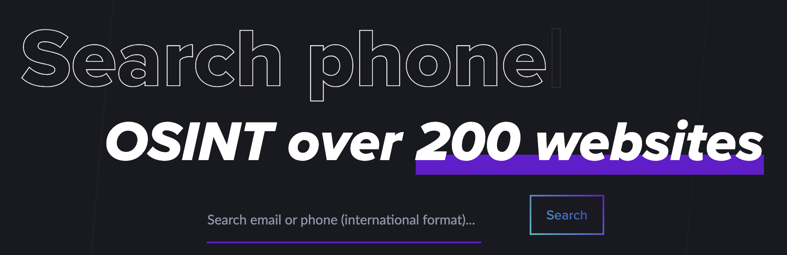

## Met deze tools kun jij een luie (lees: <mark>efficiënte</mark>, <mark>doelgerichte</mark> en <mark>innovatieve</mark>) journalist worden

**tools**: [Zoekmachines](#zoekmachines) • [Email & Telefoon](#emailphone) • [Usernames](#usernames) • [Sociale Media](#social):  *[Facebook](#fb)*, *[Instagram](#insta)*, *[Telegram](#telegram)*, *[YouTube](#youtube)*, *[TikTok](#tiktok)*, *[Reddit](#reddit)*, *[Discord](#discord)*, *[X (voorheen Twitter)](#twitter)*, *[LinkedIn](#linkedin)*, *[Mastondon](mastodon)*, *[BlueSky](#bluesky)* • [Websites & Domeinen](#websites) • [Beeld & Audio](#beeld) • [Verificatie](#verificatie) • [Data](#data): *[Verzamelen](#verzamelen)*, *[Bewerken](#bewerken)*, *[Visualiseren](#visualiseren)* • [AI](#ai) • [Crypto](#crypto) • [Overig](#overig)

*"Ken je nog een tooltje voor...", is een van de meest gestelde vragen onder journalisten, onderzoekers en iedereen die nieuwsgierig is. Iedereen wil <mark>meer, beter en efficiënter</mark> onderzoek doen. Eigenlijk moet je jezelf de vraag stellen: "Hoe kan ik een luie journalist worden?"*

*En nee, natuurlijk zijn journalisten niet lui. Maar we kunnen wel leren van luie mensen. Hoe kun je iemand – of in dit geval, iets – anders <mark>het zware werk laten doen</mark>? Deze site helpt je daarbij. Hieronder vind je tientallen websites, scripts en apps die technisch ingewikkeld en tijdrovend werk voor je kunnen opknappen.*

*Reminder: tools zijn niets waard zonder te begrijpen hoe ze werken. Het is enkel een <mark>shortcut voor handmatig werk</mark>. Dus vertrouw de resultaten uit zo'n tool niet zonder te snappen wat er onder de motorkap plaatsvindt. En onthoud: <mark>don't be evil</mark>. Je kunt alle tools inzetten voor goede, maar ook voor kwade bedoelingen.*

*Heb je een goede toevoeging aan deze site? Of wil je een bedankje sturen? [Check onderaan deze pagina hoe je met mij in contact kunt komen ⬇](#einde)*

### <i class="fa fa-search" aria-hidden="true"></i> Zoekmachines
Je bent natuurlijk allang bekend met alle grote zoekmachines, zoals Google, Bing en Yandex. Met onderstaande gespecialiseerde zoekmachines kun je nog dieper in het web duiken.

##### <a href="https://e-justice.europa.eu/content_find_a_company-489-en.do" target="_blank">E-justice Business Register</a> | <mark>Website</mark>
In dit register kun je internationaal zoeken in alle Kamers van Koophandel van EU-landen. Erg handig als je niet exact weet op welke site je in het buitenland moet zoeken.

##### <a href="https://haveibeenpwned.com/" target="_blank">HaveIBeenPownd</a> | <mark>Website</mark>

Op deze site kun je checken of een emailadres in een datalek voorkomt. Handig om je eigen digitale veiligheid te checken, maar ook om te controleren of een mailadres daadwerkelijk gebruikt wordt. Voor telefoonnummers kun je checken of ze in de <a href="https://nos.nl/artikel/2375266-gegevens-van-honderden-miljoenen-facebookgebruikers-op-hackersforum-gedeeld" target="_blank">Facebook Data Breach</a> hebben gestaan.

##### <a href="https://www.shodan.io/" target="_blank">Shodan</a> | <mark>Website</mark>

Shodan is de zoekmachine voor apparaten die aan het internet zijn verbonden. <a href="https://github.com/lothos612/shodan" target="_blank">Check ook deze pagina</a> om slimme zoekopdrachten (dorks) te formuleren.

##### <a href="https://www.social-searcher.com/" target="_blank">SocialSearcher</a> | <mark>Website</mark>

SocialSearcher is een zoekmachine waarmee je o.a. in de openbare comments van Reddit, YouTube, Facebook en VKontakte kunt zoeken.

##### <a href="https://search.0t.rocks/" target="_blank">ZeroTrust</a> | <mark>Website</mark>

Op Search.0t.rocks (spreek uit als ZeroTrust) kun je door meerdere datalekken zoeken en worden de zoekresultaten aan elkaar gekoppeld. Wachtwoorden zijn niet zichtbaar. De site is meerdere keren offline gehaald, maar <a href="https://github.com/MiyakoYakota/search.0t.rocks" target="_blank">hier staat de code</a> om je eigen versie te hosten.

[terug naar overzicht ⬆](#)

### <i class="fa fa-envelope" aria-hidden="true"></i> Email & Telefoon
Het startpunt van veel online onderzoeken: een mailadres of telefoonnummer. Maar nu wil je weten wie dat mailtje leest of die telefoon opneemt. Met deze tools kun je meer informatie vinden.

##### <a href="https://epieos.com/" target="_blank">Epieos</a> | <mark>Website</mark>

Op Epieos kun je checken waar specifieke telefoonnummers en mailadressen worden gebruikt. Vooral handig voor Google-accounts en Skype.

##### <a href="https://github.com/megadose/holehe" target="_blank">Holehe</a> | <mark>Script</mark>

Met Holehe kun je checken of een emailadres is geregistreerd op >50 websites. Bij sommige sites krijg je ook info over het account zelf.

##### <a href="https://github.com/AzizKpln/Moriarty-Project" target="_blank">Moriarty</a> | <mark>Script</mark>

Met Moriarty kun je checken of een telefoonnummer bekend staat als dubieus. Ook wordt gezocht of er socialmedia-accounts aan dit nummer zijn gekoppeld.

##### <a href="https://osint.industries/" target="_blank">OSINT.industries</a> | <mark>Website</mark>

Op Osint.Industries kun je (grotendeels betaald) rondzoeken op welke websites specifieke mailadressen en telefoonnummers staan geregistreerd. Onderzoeksjournalisten kunnen <a href="https://osint.industries/journalist" target="_blank">een gratis account aanvragen</a>.

##### <a href="https://github.com/sundowndev/phoneinfoga" target="_blank">PhoneInfoga</a> | <mark>Script</mark>

Met PhoneInfoga kun je opzoeken of een telefoonnummer bestaat en wat er over dat nummer te vertellen is. Ook kun je checken aan welke accounts dat nummer is gekoppeld.

##### <a href="https://github.com/jakecreps/poastal" target="_blank">Poastal</a> | <mark>Script</mark>

Met Poastal lanceer je een zoekmachine in je browser waarmee je kunt uitzoeken of een mailadres geregistreerd staat bij specifieke sociale media. Daarnaast kun je uitzoeken of een mailadres überhaupt bestaat, mail kan ontvangen en bekendstaat als spam.

[terug naar overzicht ⬆](#)

### <i class="fa fa-user" aria-hidden="true"></i> Usernames
Stel, je komt tijdens je onderzoek het anonieme account <code>droge_poepsteek</code> tegen. Loopt het spoor dan dood? Met deze tools kun je alsnog aanknopingspunten vinden.

##### <a href="https://github.com/soxoj/maigret" target="_blank">Maigret</a> | <mark>Script</mark>

Met Maigret kun je opzoeken welke username aan welke websites is gekoppeld. Het is een zeer uitgebreide versie van Sherlock (ook hieronder te vinden), maar daardoor ook een stuk trager. Je kunt Maigret ook gebruiken in Telegram via het account <a href="https://t.me/osint_maigret_bot" target="_blank">@osint_maigret_bot</a>.

#####  | <mark>Script</mark>

Met Sherlock kun je checken of een username op bepaalde sites is geregistreerd. Een snellere, maar ook iets minder uitgebreide versie van Maigret.

##### <a href="https://whatsmyname.app/" target="_blank">WhatsMyName</a> | <mark>Website</mark>

Op WhatsMyName.app kun je snel op username zoeken en kijken op welke (bijna 600) sites die naam staat geregistreerd.

[terug naar overzicht ⬆](#)

### <i class="fa fa-share" aria-hidden="true"></i> Sociale Media
Stukje introtekst

#### Facebook
Stukje introductietekt

##### 

##### 

##### 

#### Instagram
Stukje introtekst

##### 

##### 

##### 

#### Telegram
Ook wel het 'Whatsapp van Oost-Europa' genoemd. De afgelopen paar jaar duiken steeds meer dubieuze groepen op in Telegram. Dat maakt het voor journalisten en onderzoekers een perfecte grabbelton voor nieuwe onderwerpen.

##### 

##### 

##### 

#### YouTube
Stukje introtekst

##### 

##### 

##### 

#### Tiktok
Stukje introtekst

##### 

##### 

##### 

#### Reddit
Stukje introtekst

##### 

##### 

##### 

#### Discord
Stukje introtekst

##### 

##### 

##### 

#### X (voorheen Twitter)
Sinds ene Elon Musk de baas werd, zijn bijna alle tools onbruikbaar geworden. Toch houd ik deze sectie op de site. Misschien tegen beter weten in. Maar wie nog goede suggesties heeft, is welkom om te tippen.

#### linkedin
Ooit begonnen als online CV-site, momenteel een slappe feed vol 'inspirerende' ervaringen van saaie mensen. Alsnog een goede bron van informatie, maar ik ken geen nuttige websites of tools voor LinkedIn.

#### Mastodon
Stukje tekst

#### BlueSky
Stukje tekst

[terug naar overzicht ⬆](#)

### <i class="fa fa-globe" aria-hidden="true"></i> Websites & Domeinen
Stukje introtekst

##### 

##### 

##### 

[terug naar overzicht ⬆](#)

### <i class="fa fa-video-camera" aria-hidden="true"></i> Beeld & Audio
Stukje introtekst

##### 

##### 

##### 

[terug naar overzicht ⬆](#)

### <i class="fa fa-check" aria-hidden="true"></i> Verificatie
Stukje introtekst

##### 

##### 

##### 

[terug naar overzicht ⬆](#)

### <i class="fa fa-table" aria-hidden="true"></i> Data
Stukje introtekst

#### Verzamelen
Stukje introtekst

##### 

##### 

##### 

#### Bewerken
Stukje introtekst

##### 

##### 

##### 

#### Visualiseren
Stukje introtekst

##### 

##### 

##### 

[terug naar overzicht ⬆](#)

### <i class="fa fa-lightbulb-o" aria-hidden="true"></i> AI
Stukje introtekst

##### 

##### 

##### 

[terug naar overzicht ⬆](#)

### <i class="fa fa-btc" aria-hidden="true"></i> Crypto
Ah, de toekomst van ons betalingsverkeer: gedecentraliseerd, gepseudonimiseerd en encrypted. En vooral gebruikt door crypto-bro’s en georganiseerde misdaad. Dan is het handig om wat tools te hebben om zulke transacties inzichtelijk te maken.

##### 

##### 

##### 

[terug naar overzicht ⬆](#)

### <i class="fa fa-archive" aria-hidden="true"></i> Overig
Alle tools die niet netjes in een van bovenstaande hokjes passen, heb ik hieronder verzameld.

##### 

##### 

##### 

[terug naar overzicht ⬆](#)

Deze website is gemaakt door <a href="https://www.jerryvermanen.nl/" target="_blank">Jerry Vermanen</a>, data- en onderzoeksjournalist bij Pointer (KRO-NCRV). Uiteraard heb ik deze tools met veel liefde en aandacht op een rijtje gezet, maar een fout zit in een klein hoekje. Of misschien ontbreekt er wel een tool? 

Ik doe mijn best om deze website regelmatig te updaten. Dat kan ook met jouw suggestie voor een nuttige tool. Belangrijk daarbij is:
* dat je die tool recent nog hebt gebruikt;
* dat je daar tijd, moeite of geld mee bespaart;
* en dat het specifiek voor journalisten nuttig is.

Dus heb je nog een toevoeging of correctie? <a href="mailto:jerryvermanen@gmail.com" target="_blank">Mail me dan</a>.

Al die tools zijn leuk en aardig, maar het wordt pas interessant zodra je ze voor een onderzoek kunt inzetten. Wil je op de hoogte blijven van de allerbeste data- en onderzoeksjournalistiek? Volg dan mijn nieuwsbrief Klikdinges.

<iframe style="border-radius: 4px; border: 2px solid #e5e7eb; margin: 0; background-color: transparent;" src="https://embeds.beehiiv.com/a6302f50-29c3-4818-b1cd-da3da2951c67" width="100%" height="320" frameborder="0" scrolling="no" data-test-id="beehiiv-embed"></iframe>

En als deze website nuttig vindt, overweeg dan ook eens om <a href="https://www.vanduurenmedia.nl/EAN/9789463562638/Handboek_Internetresearch_en_datajournalistiek_7e_editie?utm-rid=40090" target="_blank">via deze link het Handboek Internetresearch & Datajournalistiek</a> te bestellen. Met deze referral krijgen wij als makers van dat handboek een iets hoger percentage per verkocht exemplaar. Dit is de beste manier om me een bedankje te sturen. En je doet jezelf er ook nog eens een groot plezier mee ❤️

* Deze site is gemaakt in [Jekyll](https://jekyllrb.com/) + [Good Clean Read](https://github.com/adueck/good-clean-read)
* [Changelog](https://raw.githubusercontent.com/jerryvermanenpointer/luiejournalist/master/changelog.md)

